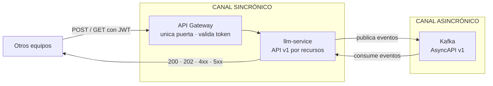
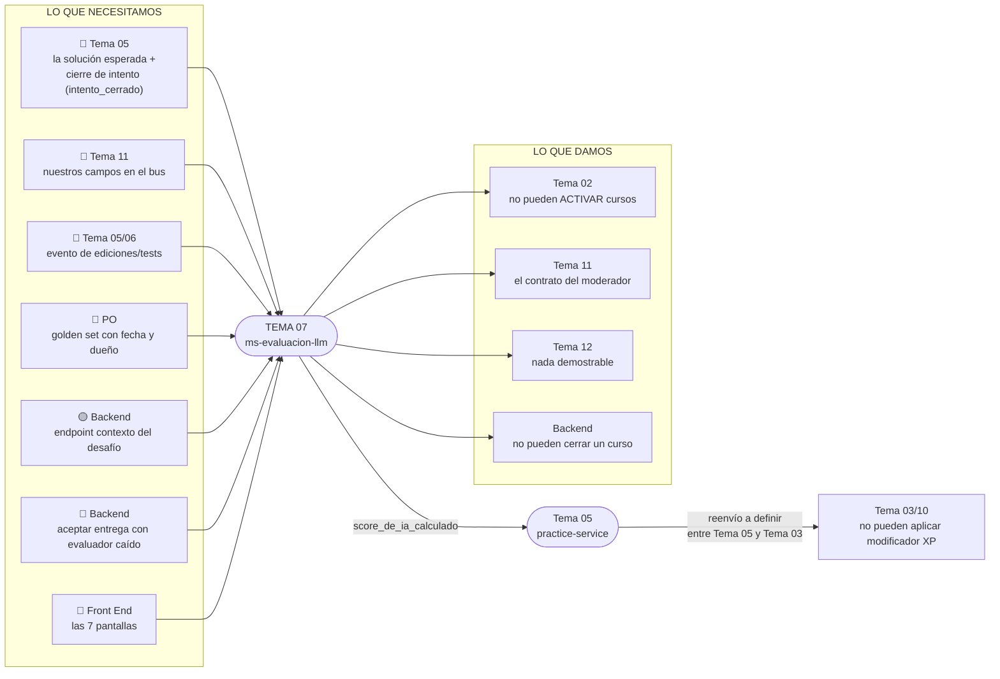

# 18 — Contratos inter-equipos

> **Con quién hablamos, qué les pedimos, qué les damos, por dónde y en qué formato.**
>
> Este documento es el punto de entrada para cualquier sesión de integración. No reemplaza a los
> otros diecisiete: los resume desde afuera hacia adentro, con los ojos de los equipos que nos
> integran. Si un equipo necesita saber «qué tienen que implementar ellos para que nosotros
> funcionemos», este es el documento.

---

## Estado vigente — contratos v1

Esta guía conserva el contrato anterior para contexto, pero no es el contrato ejecutable. El
contrato vigente es [`contracts/llm-service-v1.openapi.yaml`](contracts/llm-service-v1.openapi.yaml)
para HTTP y [`contracts/llm-service-v1.asyncapi.yaml`](contracts/llm-service-v1.asyncapi.yaml) para
Kafka. Todas las rutas usan `/api/llm/**`, los servicios se identifican con M2M
`aud=llm-service`, y la correlación usa `traceparent` + `X-Request-Id`.

| Par | Responsabilidad acordada |
|---|---|
| `practice-service` | Envía contexto validado al tutor y conserva la frontera de UI. Desde el 2026-09-13, también publica `intento_cerrado.v1` (con transcripción) y recibe el score — antes lo hacía `challenges-service` directo. |
| `challenges-service` | Aplica XP a partir del score que le reenvía `practice-service` (PAR-05). **Ya no se comunica directo con `llm-service`** — ver [§4.2](#42-tema-03--motor-de-desafíos). |
| `courses-service` | Consulta calibración y pendientes antes de activar/cerrar. |
| `admin-service` | Gestiona modelo, golden set y calibración como operación delegada. |

Los eventos de integración se transportan por Kafka. Las funciones de Fase 2/Fase 3 no se
publican en el contrato MVP.

---

## 0. Cómo leemos los contratos

Antes de entrar en cada equipo, tres reglas que aplican a **todos** los contratos:

| Regla | Por qué importa |
|---|---|
| **El API Gateway es la única puerta** | Nadie llega directo a `llm-service`, ni HTTP, ni gRPC, ni llamada interna directa. Todo pasa por el gateway. |
| **Lo asincrónico viaja por Kafka** | Publicar un evento no es hacer un POST a otro microservicio. Son canales distintos con garantías distintas. |
| **La correlación viaja en headers** | Cada request y evento propaga `traceparent` y `X-Request-Id`; los cuerpos no usan `trace_id`. |

### Los dos canales de comunicación



---

## Anexo histórico — contrato anterior de seis endpoints

> Las rutas y schemas de esta sección están retirados. Consultar los contratos v1 antes de integrar
> o generar mocks.

Seis endpoints, dos verbos. **Solo estos**. Cualquier otro endpoint que aparezca en otro documento
es un error o diseño interno que no es parte del contrato público.

### 1.1 Tabla resumen

| # | Verbo | Ruta | Quién la usa | Modo | Qué devuelve |
|---|---|---|---|---|---|
| 1 | `POST` | `/ai/{funcion}` | Tema 03, 05, 11 | sync o async (según `X-Mode`) | `200` con resultado o `202` con `job_id` |
| 2 | `GET` | `/ai/jobs/{job_id}` | Quien encoló | — | Estado del trabajo + resultado si completó |
| 3 | `POST` | `/ai/ingesta` | Tema 02 | Async siempre | `202` + `job_id` |
| 4 | `POST` | `/ai/calibracion` | Tema 12 / ADMIN | Async siempre | `202` + `job_id` |
| 5 | `GET` | `/ai/calibracion/{curso_cohorte_id}` | **Tema 02** | — | Estado de calibración (**bloquea activación de curso**) |
| 6 | `GET` | `/ai/pendientes/{curso_cohorte_id}` | Backend | — | Evaluaciones sin score (**bloquea cierre de curso**) |

> **Los endpoints 5 y 6 son los de mayor prioridad de entrega**, aunque devuelvan un mock.
> Son los que bloquean a otros equipos si no existen.

### 1.2 Valores válidos de `{funcion}`

| Valor | Qué hace | Modo |
|---|---|---|
| `tutor` | Asiste al alumno en el desafío | Sync (`< 2 s`) |
| `moderador` | Modera un mensaje de chat | Sync (`< 300 ms`) |
| `evaluador` | Evalúa un intento cerrado | Async (minutos) |
| `generador` | Genera preguntas de parcial | Async (minutos) |

### 1.3 Estructura del request (POST /ai/{funcion})

```json
{
  "idempotency_key": "idem-uuid-001",
  "curso_cohorte_id": "sale-del-token-no-del-body",
  "alumno_id":        "sale-del-token-no-del-body",
  "payload": {
    "mensaje":         "texto del alumno",
    "intento_id":      "uuid del intento",
    "transcripcion":   []
  },
  "mode": "sync | async"
}
```

> `curso_cohorte_id` y `alumno_id` **los deriva el servidor del token JWT** que propaga el gateway.
> El cliente no los manda en el body. Si los manda, se ignoran.

### 1.4 Estructura de la respuesta exitosa (200)

```json
{
  "trace_id":       "propagado desde el gateway",
  "job_id":         "uuid (solo en 202)",
  "estado":         "completado | en_proceso | fallido",
  "resultado": {
    "score_agregado": 78,
    "dimensiones": {
      "claridad":     25,
      "autonomia":    30,
      "progresion":   20,
      "cumplimiento": 15,
      "eficiencia":   10
    },
    "confianza":      0.92,
    "justificacion":  "texto por dimensión",
    "prompt_version": "v2.3",
    "rubric_version": "v1.1",
    "model_id":       "gemini-flash-lite",
    "model_version":  "2025-05"
  },
  "metadata": {
    "tokens_entrada": 3000,
    "tokens_salida":  250,
    "latencia_ms":    1340,
    "costo_usd":      0.00052
  }
}
```

> **Nunca devolvemos XP.** Devolvemos `score_agregado` (0–100). El XP y el modificador
> lo aplica el motor de desafíos (Tema 03/10).

### 1.5 Códigos de error tipados

| HTTP | `codigo` | Qué significa |
|---|---|---|
| `429` | `cuota_agotada` | El alumno agotó su cuota diaria (RF-IA-22) |
| `503` | `proveedor_no_disponible` | El proveedor LLM no responde |
| `409` | `calibracion_pendiente` | El curso no tiene calibración aprobada |
| `422` | `payload_invalido` | El body no pasa la validación |
| `401` | `token_invalido` | El JWT no es válido o expiró |

---

## 2. Eventos que publicamos

### 2.1 `score_de_ia_calculado`

**Consumidor:** Tema 05 (Desafíos Prácticos), Tema 10.

> ⚠️ **Cambió el 2026-09-13.** Antes el consumidor era Tema 03 (Motor de desafíos) directo. Desde
> la decisión de diseño que centraliza el intercambio del evaluador en Tema 05, es Tema 05 quien
> consume este evento y quien se lo reenvía a Tema 03 para que aplique el modificador de XP —
> nosotros ya no publicamos nada directo para Tema 03. Ver
> [`equipos/tema-05-desafios-practicos/contratos.md`](equipos/tema-05-desafios-practicos/contratos.md).

```json
{
  "evento":           "score_de_ia_calculado",
  "version":          "1.0",
  "trace_id":         "uuid",
  "timestamp":        "ISO-8601",
  "curso_cohorte_id": "uuid",
  "intento_id":       "uuid",
  "alumno_id":        "uuid",
  "score_agregado":   78,
  "dimensiones": {
    "claridad":     25,
    "autonomia":    30,
    "progresion":   20,
    "cumplimiento": 15,
    "eficiencia":   10
  },
  "confianza":        0.92,
  "rubric_version":   "v1.1",
  "model_id":         "claude-haiku-4.5",
  "model_version":    "batch-2025-05",
  "estado":           "aplicado"
}
```

### 2.2 `score_pendiente_diferido`

**Consumidores:** Tema 05, Backend.

> ⚠️ Mismo cambio que 2.1: Tema 05 es el consumidor desde el 2026-09-13, no Tema 03.

```json
{
  "evento":           "score_pendiente_diferido",
  "version":          "1.0",
  "trace_id":         "uuid",
  "timestamp":        "ISO-8601",
  "curso_cohorte_id": "uuid",
  "intento_id":       "uuid",
  "alumno_id":        "uuid",
  "motivo":           "proveedor_no_disponible | cuota_agotada",
  "reintentar_desde": "ISO-8601"
}
```

> Mientras haya un `score_pendiente_diferido` sin resolver, el endpoint
> `GET /ai/pendientes/{curso_cohorte_id}` lo retorna como bloqueante y el curso no se puede cerrar.

### 2.3 `calibracion_aprobada` / `calibracion_fuera_de_tolerancia`

**Consumidores:** Tema 02, Tema 12

```json
{
  "evento":           "calibracion_aprobada",
  "version":          "1.0",
  "trace_id":         "uuid",
  "timestamp":        "ISO-8601",
  "curso_cohorte_id": "uuid",
  "rubric_version":   "v1.1",
  "kappa":            0.82,
  "muestras":         30
}
```

### 2.4 `incidente_de_jailbreak`

**Consumidores:** Tema 12, equipo de seguridad

```json
{
  "evento":           "incidente_de_jailbreak",
  "version":          "1.0",
  "trace_id":         "uuid",
  "timestamp":        "ISO-8601",
  "curso_cohorte_id": "uuid",
  "alumno_id":        "uuid",
  "funcion":          "tutor | moderador",
  "tipo":             "injection | perimetro | ofensivo",
  "severidad":        "alta | media | baja"
}
```

---

## 3. Eventos que consumimos

| Evento | Lo publica | Qué dispara en nosotros |
|---|---|---|
| `intento_cerrado` | Tema 05 — Desafíos Prácticos (desde el 2026-09-13; antes lo publicaba Tema 03 directo — ver [§4.2](#42-tema-03--motor-de-desafíos)) | Encola la evaluación del intento |
| `curso_archivado` | Tema 02 — Cursos | Frena todos los trabajos pendientes de ese curso-cohorte |
| `modelo_llm_cambiado` | Tema 12 — Backoffice | Dispara recalibración automática (RF-IA-32) |

### Estructura mínima que necesitamos en `intento_cerrado`

```json
{
  "evento":           "intento_cerrado",
  "version":          "1.x",
  "trace_id":         "uuid — OBLIGATORIO",
  "timestamp":        "ISO-8601",
  "curso_cohorte_id": "uuid — OBLIGATORIO",
  "intento_id":       "uuid — OBLIGATORIO",
  "alumno_id":        "uuid — OBLIGATORIO",
  "rubric_version":   "v1.1 — OBLIGATORIO para elegir la calibración",
  "transcripcion":    []
}
```

> **URGENTE:** El Tema 11 define el contrato de eventos para toda la plataforma.
> Pedir estos campos **antes de que lo cierren**. Después es renegociar con cinco equipos.

---

## 4. Lo que necesitamos de cada equipo

### 4.1 Tema 02 — Cursos y Matrícula

**Nos llaman para:**

- `GET /ai/calibracion/{curso_cohorte_id}` — verificar si la calibración está aprobada antes de activar el curso

**Nos tienen que dar:**

- Material del curso para indexar (via `POST /ai/ingesta`)
- Confirmación del modelo `curso_template_id` vs `curso_cohorte_id` (I-09)

**🔴 Bloqueo crítico:**

- El **golden set** (muestras del docente para calibrar la rúbrica). Sin esto, ningún curso puede activarse. Es la dependencia con el plazo más largo del proyecto.

---

### 4.2 Tema 03 — Motor de Desafíos

> ⚠️ **Integración indirecta desde el 2026-09-13.** `llm-service` dejó de comunicarse directo
> con el Motor de Desafíos. Todo el intercambio del evaluador pasa ahora por Tema 05 — ver
> [§4.3](#43-tema-05--desafíos-prácticos). Lo que sigue describe el contrato **anterior**,
> directo, que queda retirado y se conserva como registro.

**Nos llamaban para (retirado):**

- `POST /ai/evaluador` (async)
- `GET /ai/jobs/{job_id}`

**Nos tenían que dar (retirado):**

- Publicar `intento_cerrado` con los campos de §3 — ahora lo publica Tema 05.
- **🔴 Aceptar la entrega con el evaluador caído**: si respondemos `503`, el backend acepta igual con `score_agregado = null` y espera `score_pendiente_diferido`. La resiliencia de este punto es del lado que escribe en la base académica, no del nuestro. **Esto sigue vigente** — solo cambió quién nos habla, no quién absorbe la caída del evaluador.

**Lo que le queda a Tema 03 ahora:** recibir el score reenviado por Tema 05 y aplicar el
modificador de XP (PAR-05). Cómo se lo reenvía Tema 05 es una definición entre Tema 03 y Tema 05
— nosotros no somos parte de esa conversación.

**✅ I-04, resuelto de nuestro lado:** el mecanismo es el evento Kafka `score_de_ia_calculado.v1`
— un solo mecanismo, no cuatro — pero el consumidor es Tema 05, no Tema 03. Ver
[§6](#6-agenda-mínima-para-la-sesión-de-integración).

---

### 4.3 Tema 05 — Desafíos Prácticos

**Nos llaman para:**

- `POST /ai/tutor` — asistencia

**🔴 Nos tienen que dar (crítico):**

1. **La solución esperada del desafío** — sin esto el anti-fuga (RF-IA-20) no tiene contra qué comparar. Falta definir: ¿endpoint? ¿campo en el evento? ¿verbo?
2. **Evento de ediciones y ejecuciones de tests del IDE** — 30% del score depende de esta señal. Si no se pide ahora, no va a existir.

**Desde el 2026-09-13, además:**

3. **Notificarnos el cierre del intento** — evento `intento_cerrado` con la transcripción completa (mismos campos de §3, ahora publicados por Tema 05 en vez de Tema 03).
4. **Reenviarle a Tema 03 el resultado del evaluador** (`score_de_ia_calculado`, ver §2.1) que nosotros les entregamos — el impacto en XP depende de que ese reenvío se resuelva entre Tema 05 y Tema 03. Nosotros no le damos nada directo a Tema 03.

---

### 4.4 Tema 11 — Chat

**Nos llaman para:**

- `POST /ai/moderador` — siempre sync, siempre antes de entregar el mensaje al hilo

**Nos tienen que dar:**

- Incluir nuestros campos en el contrato de eventos del bus (ver §3)
- Aclarar qué enum viaja en `estado` (I-05)

**Contrato del moderador que Tema 11 necesita para diseñar el chat:**

> ⚠️ **Actualizado 2026-09-12.** Esta sección tenía un bosquejo más viejo (`veredicto` +
> `categorias` como objeto de 6 booleanos con nombres que no eran los de RF-CHT-10). Quedó
> reemplazado por la forma de
> [`contracts/llm-service-v1-moderacion-borrador.yaml`](contracts/llm-service-v1-moderacion-borrador.yaml)
> (`RespuestaModeracion`), que es más nueva, más detallada, y usa las seis categorías exactas
> de RF-CHT-10. Es la única forma vigente — si aparece la vieja en otro lado (una presentación,
> por ejemplo), es histórica.

```json
{
  "resultado": {
    "categorias": ["integridad_academica"],
    "severidad": "alta | media | baja",
    "confianza": 0.94,
    "origen": "lista | heuristica | clasificador",
    "version_lista": "2025-05-v3"
  },
  "trace_id": "uuid",
  "metadata": {
    "model_id": null,
    "model_version": null,
    "latencia_ms": 45
  }
}
```

`categorias` es un **array** de las seis categorías de RF-CHT-10 (`ofensivo_discriminatorio`,
`acoso`, `sexual_violencia`, `spam_no_academico`, `integridad_academica`,
`elusion_solo_texto`) — vacío si el mensaje está limpio, y puede traer más de una a la vez
porque los detectores clásicos corren todos y fusionan veredictos. No hay campo `veredicto`
separado: el bloqueo se infiere de `severidad` (`baja` no bloquea, `media`/`alta` sí).

> Tema 11 **NO entrega el mensaje al hilo** hasta recibir `200` con `severidad: baja`.

---

### 4.5 Tema 12 — Backoffice / ADMIN

**Nos llaman para:**

- `GET /ai/calibracion/{curso_cohorte_id}` — ver estado
- `POST /ai/calibracion` — disparar recalibración

**Nos tienen que dar:**

- Ser dueños de la pantalla de configuración del proveedor LLM
- Ser dueños de la pantalla del golden set (actualmente sin dueño claro — I-15)
- Ser dueños de la pantalla de límites de uso de IA por alumno — cantidad de usos y cantidad de
  tokens, por día —, consumiendo `PUT /api/v1/operations/quotas/student/{studentId}` (extensión de
  `LLM-S09-H02`, ver [`historias/ep-07/h02.md`](historias/ep-07/h02.md)). Pendiente de confirmar
  con Product Owner y DPO — ver [08 P-12](08-decisiones-y-pendientes.md).

---

### 4.6 Backend de negocio

**Nos tienen que dar:**

- **Endpoint de contexto del desafío** — el tutor necesita el enunciado para armar el prompt
- **Aceptar entregas con evaluador caído** — igual que §4.2
- Propagación del JWT en cada llamada

---

### 4.7 Front End — Angular

**🔴 Las 7 pantallas que necesitamos:**

| # | Pantalla | Para qué |
|---|---|---|
| 1 | Chat del tutor en el IDE | Sin esto la función principal no tiene UI |
| 2 | Estado del evaluador por intento | Para que el alumno vea el feedback |
| 3 | Rúbrica con desglose por dimensión | RF-IA-16 requiere mostrar la justificación |
| 4 | Panel de calibración (docente) | Para aprobar el golden set |
| 5 | Panel de moderación (admin) | Ver incidentes e historial |
| 6 | Dashboard de costos y uso (admin) | Visualización del Tema 12 |
| 7 | **Pantalla del golden set** | La más urgente — destraba el plazo más largo |

---

### 4.8 Product Owner

| Lo que necesitamos | Por qué no podemos avanzar sin ello |
|---|---|
| Responsable y fecha del **golden set** | Sin calibración, ningún curso se activa. Es el plazo más largo y no es trabajo de desarrollo |
| Decisión sobre el techo de cuota (15 / 10 / 8 por día) | El presupuesto del cuatrimestre cambia según el valor (I-06) |
| Quién construye la pantalla del golden set | Actualmente tiene cuatro dueños distintos en cuatro documentos (I-15) |

---

## 5. Mapa de dependencias resumido

> ⚠️ **Desde el 2026-09-13**, el par `IA → Tema 03/10` (score → XP) ya no es una arista directa:
> pasa por Tema 05. El diagrama lo dibuja como `IA → Tema 05 → Tema 03/10` para reflejar el
> intermediario; el nodo `N1` de "lo que necesitamos" también creció, porque ahora incluye el
> cierre de intento además de la solución esperada.



---

## 6. Agenda mínima para la sesión de integración

| Prioridad | Tema | Equipos | Por qué urgente |
|---|---|---|---|
| ✅ 1 | **I-04**: resuelto de nuestro lado — evento Kafka `score_de_ia_calculado.v1`, un solo mecanismo. Sigue abierto para Tema 05 y Tema 03: cómo Tema 05 le reenvía el resultado a Tema 03 | Tema 05 + Tema 03 | Tema 03 no puede empezar su lado hasta que Tema 05 y Tema 03 lo acuerden entre ellos |
| 🔴 2 | **I-05**: Qué enum viaja en `estado` del contrato de eventos | Tema 07 + Tema 11 | Contrato ambiguo si no se decide |
| 🔴 3 | **I-09**: `curso_id` vs `curso_cohorte_id` — de qué cuelga el chunk del RAG | Tema 07 + Tema 02 | Imposible migrar datos después |
| 🔴 4 | **I-08**: Esquema de la tabla `mensaje` (tres versiones incompatibles) | Tema 07 + Tema 11 | El dato que no se captura hoy no se recupera |
| 🔴 5 | **Solución esperada**: qué endpoint, verbo, payload | Tema 07 + Tema 05 | RF-IA-20 no implementable sin esto |
| 🔴 6 | **I-14**: Autenticación entre servicios — formato del token interno | Todos | Ningún endpoint dice hoy qué rol puede llamarlo |
| 🟡 7 | **I-06**: Techo de cuota (15 / 10 / 8 por día) | Tema 07 + PO | Cambia el presupuesto del cuatrimestre |
| 🟡 8 | **I-15**: Quién construye la pantalla del golden set | PO + FE + Tema 07 + Tema 12 | Destraba el ítem de plazo más largo |

---

## 7. Autenticación entre servicios

> 🔴 **I-14: pendiente de decisión.** Lo que sigue es lo que debería quedar acordado en la sesión.

- Toda llamada sincrónica pasa por el API Gateway, que valida el JWT
- Nosotros **nunca confiamos en parámetros del cliente** para identidad
- Nosotros **nunca exponemos nuestra API directamente** sin el gateway
- Acordar con todos: qué header, qué formato, qué claims mínimos viajan en el token interno

---

## 8. Reglas generales

| Regla | Qué significa |
|---|---|
| **`idempotency_key` obligatoria** | Reintento por timeout no genera dos evaluaciones |
| **`trace_id` en todo** | Request y evento. Es lo único útil para depurar entre equipos |
| **Errores tipados** | Campo `codigo` estable — nunca un string libre |
| **Nunca devolvemos XP** | Solo `score_agregado` 0-100 con desglose |
| **No escribimos en bases ajenas** | Devolvemos; el dueño persiste |
| **La degradación del evaluador no es nuestra** | Aceptar entrega con evaluador caído es lógica del backend académico |

---

## 9. Dónde encontrar más detalle

| Si querés | Andá a |
|---|---|
| Diagramas de secuencia de cada función | [17 — Mapa de integración](17-mapa-de-integracion.md) |
| El contrato completo campo por campo | [02 — Arquitectura y stack](02-arquitectura-y-stack.md) Parte 3 |
| Todos los pendientes I-01 a I-16 | [17 — §8](17-mapa-de-integracion.md) |
| Las decisiones abiertas con fecha y dueño | [08 — Decisiones y pendientes](08-decisiones-y-pendientes.md) |
| El glosario para la sesión de integración | [11 — Glosario y metadata](11-glosario-y-metadata.md) |
| Reglas de red y gateway | [gateway-y-discovery/](gateway-y-discovery/) |

---

*Este documento consolida lo que ya estaba en los documentos 01–17. No decide nada nuevo.
Los puntos marcados con 🔴 o I-XX necesitan acordarse antes de que cualquiera empiece a
codear su contraparte.*
