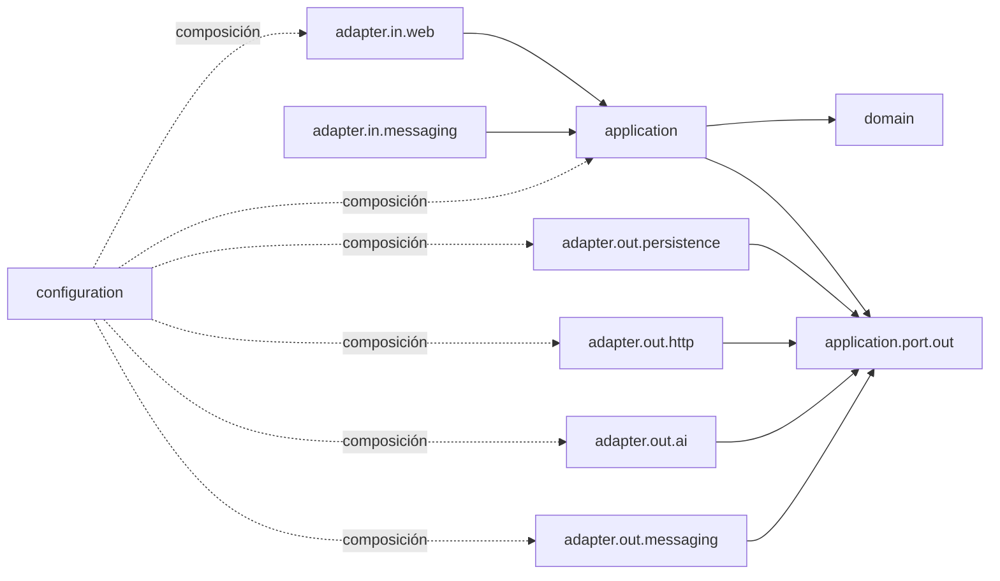
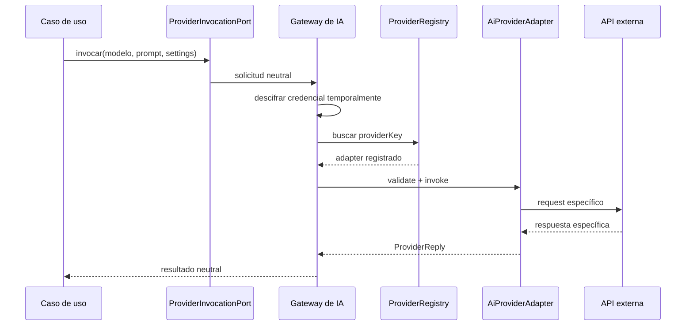

# 38 — Justificación del scaffolding Maven multi-módulo

> **Estado:** arquitectura vigente desde 2026-09-15.  
> **Tipo de documento:** explicación arquitectónica y referencia de ubicación de código.  
> **Audiencia:** desarrolladores y agentes que mantengan `llm-service`.  
> **Alcance:** backend, adaptadores de proveedores y ubicación de herramientas auxiliares. No redefine contratos HTTP, Kafka ni base de datos.

## 1. Decisión

`llm-service` será una única aplicación Spring Boot construida como un reactor Maven multi-módulo.

El ejecutable vivirá en `app`. El contrato neutral con los proveedores vivirá en `provider-spi`; cada integración concreta tendrá su propio módulo. Todos los módulos usarán el layout estándar `src/main` y `src/test` dentro de su propia carpeta.

La decisión combina dos niveles de separación:

1. **Módulos Maven:** aíslan dependencias de proveedores y controlan qué se incluye en el ejecutable.
2. **Arquitectura hexagonal dentro de `app`:** separa reglas, casos de uso y adaptadores técnicos.

Tener varios módulos Maven no significa tener varios microservicios. Solo `app` arranca un servidor y publica `/api/llm/**`.

## 2. Problema que se corrige

La estructura anterior declaraba `app` como módulo ejecutable, pero guardaba sus fuentes en el `src` de la raíz. Para compilarlas, `app/pom.xml` apuntaba hacia afuera:

```xml
<sourceDirectory>../src/main/java</sourceDirectory>
<testSourceDirectory>../src/test/java</testSourceDirectory>
<resources>
  <resource>
    <directory>../src/main/resources</directory>
  </resource>
</resources>
```

Aunque Maven permite esta configuración, genera problemas:

- El módulo no es dueño de lo que compila.
- El IDE muestra source roots externos y aparentes proyectos duplicados.
- Un build aislado de `app` depende de carpetas que están fuera del módulo.
- Las rutas dejan de ser predecibles para agentes, scripts y herramientas.
- Es más difícil determinar dónde colocar código nuevo.
- La frontera física no coincide con la frontera declarada por Maven.

La solución no es reunir todo en un único `src`. Eso volvería a acoplar los SDKs de todos los proveedores con el núcleo. La solución es que **cada módulo tenga su propio `src` estándar**.

## 3. Árbol definitivo

```text
llm-service/
├── pom.xml                         # parent y aggregator; no contiene código
├── app/                            # única aplicación Spring Boot ejecutable
│   ├── pom.xml
│   └── src/
│       ├── main/
│       │   ├── java/ar/edu/utn/frc/tup/piv/llm/
│       │   │   ├── LlmServiceApplication.java
│       │   │   ├── domain/
│       │   │   ├── application/
│       │   │   │   ├── model/
│       │   │   │   ├── port/out/
│       │   │   │   ├── service/
│       │   │   │   └── worker/
│       │   │   ├── adapter/
│       │   │   │   ├── in/web/
│       │   │   │   ├── in/web/dto/
│       │   │   │   ├── in/web/security/
│       │   │   │   ├── in/messaging/
│       │   │   │   ├── out/ai/
│       │   │   │   ├── out/http/
│       │   │   │   ├── out/messaging/
│       │   │   │   └── out/persistence/
│       │   │   └── configuration/
│       │   └── resources/
│       │       ├── application.yml
│       │       ├── application-workbench.yml
│       │       ├── db/migration/
│       │       └── prompts/
│       └── test/
│           ├── java/
│           └── resources/
├── provider-spi/                   # contrato neutral de proveedores
│   ├── pom.xml
│   └── src/main/java/
├── provider-gemini/                # integración Google Gemini
│   ├── pom.xml
│   └── src/{main,test}/
├── provider-anthropic/             # integración Anthropic
│   ├── pom.xml
│   └── src/{main,test}/
├── provider-openai-compatible/     # OpenAI, Groq y compatibles
│   ├── pom.xml
│   └── src/{main,test}/
├── llm-workbench/                  # cliente Angular de administración y demo
├── demo/                           # infraestructura local simulada
├── docs/                           # documentación del proyecto
├── scripts/                        # automatización operativa
├── Dockerfile
├── compose.yaml
└── compose.workbench.yaml
```

## 4. Qué representa cada módulo Maven

### 4.1 `pom.xml` raíz

Es el parent y aggregator del reactor. Su `packaging` es `pom`.

Responsabilidades:

- Fijar versión de Java y versiones compartidas.
- Centralizar `dependencyManagement` y configuración común de plugins.
- Enumerar los módulos en orden de compilación.
- Permitir construir todo desde un único comando.

No debe contener `src`, lógica, recursos ni configuración de ejecución.

### 4.2 `app`

Es el único módulo Spring Boot ejecutable.

Contiene:

- Punto de entrada `LlmServiceApplication`.
- Controllers y seguridad HTTP.
- Casos de uso y workers.
- Reglas de dominio.
- Persistencia PostgreSQL y Flyway.
- Integración Kafka.
- Gateway interno de IA.
- Configuración de Spring.

Depende de `provider-spi` y de los módulos concretos que deban estar instalados en ese despliegue. El plugin de Spring Boot empaqueta todo en un único JAR ejecutable.

### 4.3 `provider-spi`

SPI significa *Service Provider Interface*. Es el contrato que una integración debe cumplir para ser reconocida por la aplicación.

Contiene tipos neutrales como:

- `AiProviderAdapter`
- `ProviderDescriptor`
- `CredentialField`
- `ProviderCredentialMaterial`
- `ProviderInvocation`
- `ProviderReply`
- `ModelDescriptor`
- `ProviderCapabilities`

No contiene SDKs de Gemini, Anthropic u OpenAI. Tampoco depende de `app`.

### 4.4 Módulos `provider-*`

Cada módulo concreto:

- Depende de `provider-spi`.
- Depende únicamente del SDK y soporte técnico de su proveedor.
- Implementa `AiProviderAdapter`.
- Declara una auto-configuración de Spring Boot.
- Valida sus credenciales.
- Descubre modelos.
- Traduce la invocación neutral a la API externa.
- Normaliza la respuesta externa como `ProviderReply`.

Estos módulos son librerías internas, no servidores. No tienen `main`, puerto HTTP, base de datos ni ciclo de despliegue independiente.

## 5. Cómo funciona el build

El POM raíz conoce todos los módulos:

```text
provider-spi
   ├── provider-gemini
   ├── provider-anthropic
   └── provider-openai-compatible
              └── app
```

Al ejecutar:

```bash
./mvnw -pl app -am package
```

Maven interpreta:

- `-pl app`: construir el módulo `app`.
- `-am`: construir también los módulos del reactor que `app` necesita.

El resultado es un único artefacto ejecutable:

```text
app/target/llm-service-0.0.1-SNAPSHOT.jar
```

El Dockerfile copia ese JAR. No se genera una imagen ni un proceso por proveedor.

## 6. Arquitectura interna de `app`

### 6.1 Dirección de dependencias



La aplicación define lo que necesita mediante puertos. Los adaptadores implementan esos puertos. Así, el caso de uso no sabe si los datos vienen de PostgreSQL, de una API HTTP o de un fake de prueba.

### 6.2 `domain`

Contiene reglas de negocio puras:

- Cálculos.
- Validadores.
- Máquinas de estados.
- Value objects.
- Excepciones de dominio.

No puede importar Spring, Jakarta, JDBC, Kafka, Jackson, LangChain4j ni adaptadores.

Ejemplo: calcular MAE pertenece a dominio. Leer los puntajes desde PostgreSQL no.

### 6.3 `application`

Orquesta casos de uso.

```text
application/
├── model/       # comandos, resultados y records compartidos
├── port/out/    # interfaces requeridas para hablar con el exterior
├── service/     # casos de uso
└── worker/      # ejecución programada o diferida
```

Un servicio de aplicación puede:

- Validar el flujo de un caso de uso.
- Invocar dominio.
- Consultar o guardar mediante un puerto.
- Coordinar auditoría, idempotencia y publicación.

No puede importar una implementación JDBC, un controller o un SDK externo.

### 6.4 `adapter.in`

Representa entradas a la aplicación.

`adapter.in.web` contiene:

- Controllers REST.
- Manejo RFC 7807.
- SSE.
- Mapeo entre DTO HTTP y modelos de aplicación.

`adapter.in.web.security` interpreta autenticación, scopes, identidad delegada y headers de correlación.

`adapter.in.messaging` contiene listeners Kafka que validan el envelope y llaman a un caso de uso.

Un adaptador de entrada no accede directamente a JDBC, Kafka de salida ni proveedores de IA.

### 6.5 `adapter.out`

Implementa las interfaces de `application.port.out`:

| Carpeta | Responsabilidad |
|---|---|
| `adapter.out.persistence` | SQL, `JdbcTemplate`, mapeo de filas y transacciones de persistencia. |
| `adapter.out.http` | Clientes M2M a otros servicios a través del API Gateway. |
| `adapter.out.ai` | Selección de proveedor, descifrado temporal e invocación neutral. |
| `adapter.out.messaging` | Publicación Kafka y despacho de outbox. |

Los adapters pueden depender de aplicación y dominio porque deben convertir tecnología externa al lenguaje interno. La dirección inversa está prohibida.

### 6.6 `configuration`

Es la composición de la aplicación:

- Configura beans.
- Activa perfiles.
- Define CORS y propiedades.
- Conecta puertos con adaptadores.

No debe contener reglas de negocio.

## 7. Cómo funciona una petición HTTP

Ejemplo conceptual: guardar una credencial Gemini.

```text
1. POST /api/llm/admin/provider-credentials
2. ProviderCredentialController valida el DTO y la autorización.
3. ProviderAdministrationService ejecuta el caso de uso.
4. ProviderCatalogPort localiza el provider por providerKey="gemini".
5. El adapter Gemini valida configuration y secrets.
6. El puerto de cifrado cifra secrets.apiKey.
7. ProviderCredentialPort guarda la credencial mediante PostgreSQL.
8. El controller devuelve el resumen sin incluir la API key.
```

El controller conoce HTTP, pero no conoce SQL ni el SDK de Gemini. El servicio conoce el proceso, pero no conoce `JdbcTemplate`. El adapter de persistencia conoce SQL, pero no decide reglas del caso de uso.

## 8. Cómo funciona una invocación de IA



La API key solo está descifrada durante la operación. No vuelve al frontend ni debe aparecer en logs o excepciones.

## 9. Cómo se registra un proveedor

Cada módulo concreto aporta un bean de tipo `AiProviderAdapter` mediante auto-configuración.

Al iniciar:

1. Spring carga las auto-configuraciones incluidas en el classpath.
2. Cada módulo crea su implementación de `AiProviderAdapter`.
3. `ProviderRegistry` recibe la lista completa.
4. El registro normaliza cada `providerKey`.
5. Si dos adapters usan la misma clave, el inicio falla.
6. El catálogo administrativo expone los descriptores registrados.

No existe un `switch` central para Gemini, Anthropic u OpenAI.

## 10. Cómo agregar un proveedor nuevo

Ejemplo: `provider-mistral`.

1. Crear el módulo `provider-mistral` con layout Maven estándar.
2. Declarar como dependencia `provider-spi` y el SDK requerido.
3. Implementar `AiProviderAdapter`.
4. Definir `descriptor()`, campos de credencial y capacidades.
5. Implementar validación, descubrimiento e invocación.
6. Crear una `@AutoConfiguration` que publique el adapter.
7. Registrar la auto-configuración en:

   ```text
   META-INF/spring/org.springframework.boot.autoconfigure.AutoConfiguration.imports
   ```

8. Agregar el módulo al reactor raíz.
9. Agregarlo como dependencia de `app` si debe instalarse en ese despliegue.
10. Probar descriptor y validación sin usar una API key real.
11. Verificar que `GET /api/llm/admin/providers` lo incluya.

No se modifican controllers, casos de uso, tablas ni calibración para agregarlo.

## 11. Dónde colocar código nuevo

| Necesidad | Ubicación |
|---|---|
| Endpoint o DTO HTTP | `app/.../adapter/in/web` o `adapter/in/web/dto` |
| Autenticación y headers HTTP | `app/.../adapter/in/web/security` |
| Listener Kafka | `app/.../adapter/in/messaging` |
| Caso de uso | `app/.../application/service` |
| Worker o scheduler | `app/.../application/worker` |
| Interfaz requerida por aplicación | `app/.../application/port/out` |
| Comando o resultado neutral | `app/.../application/model` |
| Regla de negocio pura | `app/.../domain` |
| SQL o mapeo JDBC | `app/.../adapter/out/persistence` |
| Cliente HTTP M2M | `app/.../adapter/out/http` |
| Gateway neutral de IA | `app/.../adapter/out/ai` |
| Publisher u outbox Kafka | `app/.../adapter/out/messaging` |
| Bean o configuración de perfil | `app/.../configuration` |
| Contrato de providers | `provider-spi` |
| Integración de un proveedor | su módulo `provider-*` |
| Fake o stub | `src/test`, nunca `src/main` |
| Migración Flyway | `app/src/main/resources/db/migration` |
| Prompt versionado | `app/src/main/resources/prompts` |

## 12. Anti-patrones prohibidos

### Sources externos al módulo

```xml
<!-- Prohibido -->
<sourceDirectory>../src/main/java</sourceDirectory>
```

### Controller que usa persistencia

```java
// Prohibido
class ExampleController {
  private final JdbcTemplate jdbc;
}
```

El controller debe llamar a un servicio de aplicación.

### Aplicación que conoce el adapter

```java
// Prohibido
class ExampleService {
  private final JdbcProviderCredentialAdapter repository;
}
```

El servicio debe depender de `ProviderCredentialPort`.

### Tipo de infraestructura filtrado

```java
// Prohibido
ProviderCredentialRepository.Credential
```

Los records compartidos deben vivir en `application.model`.

### SDK concreto dentro de `app`

```java
// Prohibido dentro de app
import dev.langchain4j.model.googleai.GoogleAiGeminiChatModel;
```

Ese import pertenece exclusivamente a `provider-gemini`.

### Fake dentro de producción

Un fake creado para pruebas debe vivir en `src/test`. Que no tenga `@Component` no justifica incluirlo dentro del JAR.

## 13. Protección automática

`app` tendrá tests ArchUnit que impedirán:

- Dependencias de dominio hacia frameworks o adapters.
- Dependencias de aplicación hacia adapters.
- Dependencias directas entre adapters de entrada y salida.
- Controllers que conozcan repositories o `JdbcTemplate`.
- Código de `app` que importe implementaciones concretas de proveedores.
- Clases JDBC fuera de `adapter.out.persistence`.
- Fakes dentro de fuentes productivas.

Estas pruebas convierten la arquitectura en una regla ejecutable. La estructura deja de depender solamente de disciplina o revisión manual.

## 14. Qué permanece igual

La reorganización no altera:

- `/api/llm/**`.
- Payloads, respuestas y códigos HTTP.
- Streaming SSE.
- `traceparent`, `X-Request-Id` e identidad delegada.
- Topics o envelopes Kafka.
- Tablas y datos PostgreSQL.
- Contenido y checksum de migraciones Flyway.
- `AiProviderAdapter`.
- Coordenadas Maven públicas.
- Nombre del JAR y forma de despliegue.

Mover una migración desde el `src` raíz a `app/src/main/resources` no modifica su checksum si su contenido permanece byte a byte idéntico.

## 15. Comandos de verificación

Desde la raíz de `llm-service`, con JDK 21:

```bash
./mvnw -version
./mvnw clean compile
./mvnw -pl provider-spi test
./mvnw -pl provider-gemini -am test
./mvnw -pl provider-anthropic -am test
./mvnw -pl provider-openai-compatible -am test
./mvnw -pl app -am test
./mvnw verify
./mvnw jacoco:report
```

Para verificar el empaquetado y el escenario desplegado:

```bash
docker compose build llm-service
docker compose up -d --wait
./scripts/smoke-compose.sh
docker compose down --volumes --remove-orphans
```

## 16. Resumen de la decisión

La arquitectura definitiva mantiene una sola aplicación y separa las integraciones como librerías internas. Cada módulo es autocontenido, cada carpeta expresa una responsabilidad y las dependencias apuntan hacia el núcleo.

El propósito no es tener más carpetas: es que una persona pueda determinar qué hace un archivo, de qué puede depender y dónde debe vivir sin inspeccionar todo el proyecto. Maven protege el aislamiento entre proveedores; los puertos protegen los casos de uso; ArchUnit evita que las fronteras vuelvan a degradarse.
