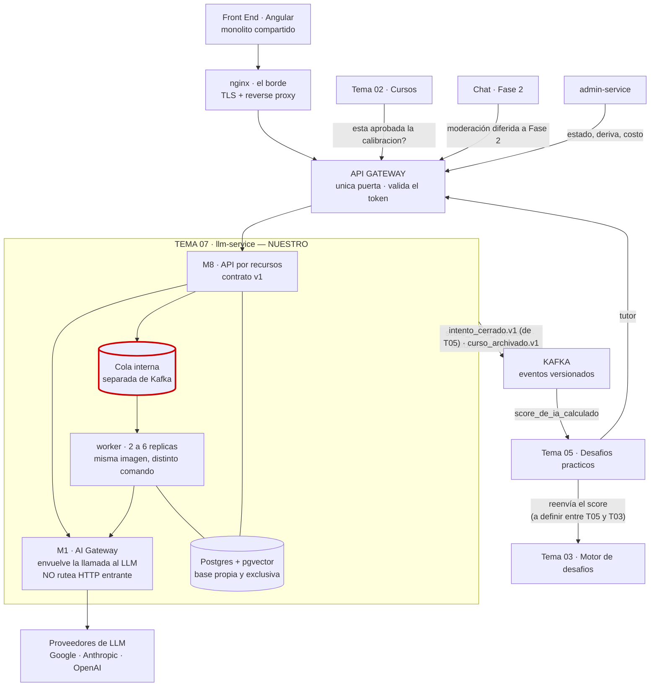
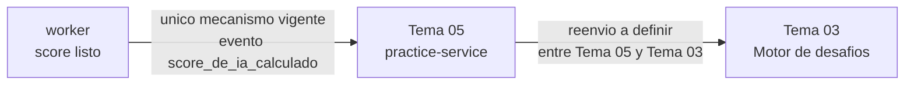
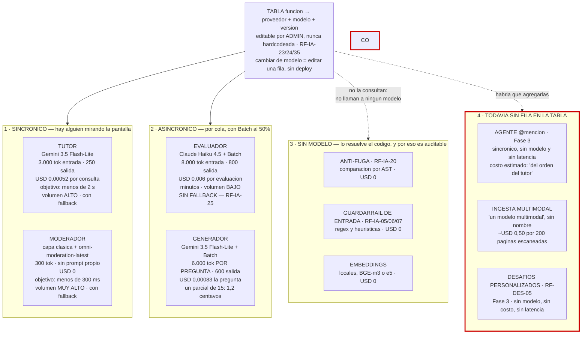
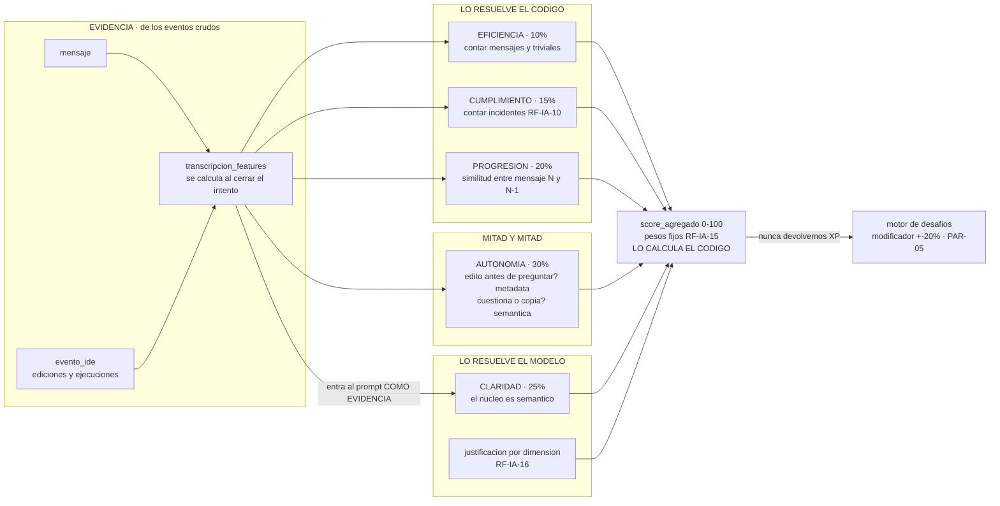
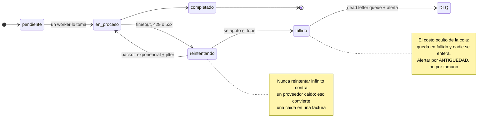
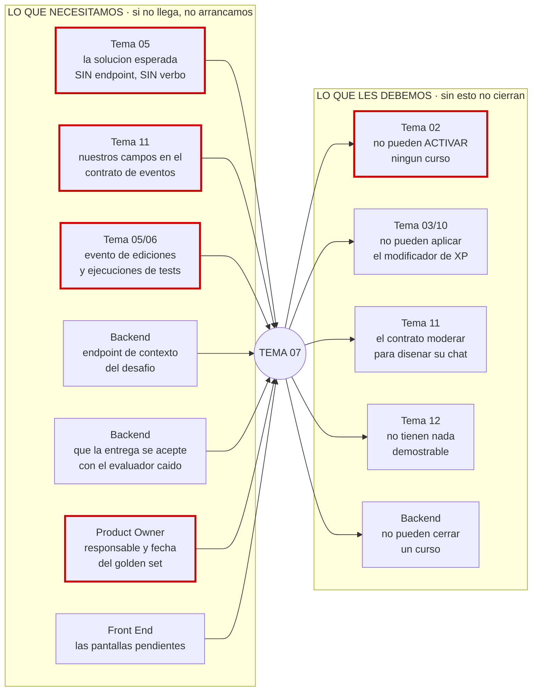

# 17 — El mapa de integración

> **Cómo se comunica el servicio, en un solo lugar.** Quién nos habla y por dónde, qué verbo tiene
> cada endpoint, cuánto tarda cada cosa, qué modelo la resuelve y qué le debemos a cada equipo.
>
> Los otros dieciséis documentos explican cada pieza por separado y lo hacen bien. Lo que faltaba
> era el cruce: **endpoint + verbo + latencia + modelo + costo en la misma vista**, que es lo que
> hace falta para repartirse el trabajo y para sentarse en la sesión de integración.
>
> Este documento **no decide nada nuevo**. Dibuja lo que ya está decidido y marca en rojo lo que
> no lo está. Lo que aparezca acá en rojo es §8, y cada punto apunta al pendiente que le
> corresponde en [08](../00-gobierno-y-evolucion/02-decisiones-y-pendientes.md)

---

## Estado vigente — contrato v1

Este mapa conserva flujos exploratorios, pero sus rutas `/ai/*`, su dispatcher por función, su
referencia a `trace_id` y sus funciones fuera de MVP están retirados. La fuente de integración es
[`contracts/llm-service-v1.openapi.yaml`](historicos-y-contratos-v1/llm-service-v1.openapi.yaml) y los eventos
viven en [`contracts/llm-service-v1.asyncapi.yaml`](historicos-y-contratos-v1/llm-service-v1.asyncapi.yaml)

| Camino | Llamador canónico | Canal vigente |
|---|---|---|
| Tutor seguro | `practice-service` | `POST /api/llm/tutor/interactions` por Gateway, síncrono. |
| Evaluación | `practice-service` (desde el 2026-09-13; antes `challenges-service` directo — ver §5) | Kafka `intento_cerrado.v1`; resultado por evento. `practice-service` reenvía el resultado a `challenges-service`. |
| Calibración y golden set | `admin-service` | Recursos `/api/llm/golden-sets` y `/api/llm/calibrations` por Gateway. |
| Activación y cierre | `courses-service` | Lecturas de calibración y pendientes bajo `/api/llm/course-cohorts/...`. |

RAG, ingesta, moderación y generador no son rutas MVP. El corrector LLM queda fuera del alcance
vigente. La cola interna no determina el
contrato externo y Kafka es el único bus de integración acordado.

---

## 1. El contexto: quién nos habla y por dónde

Dos caminos, y no compiten. **Lo sincrónico entra por el API Gateway; lo asincrónico sale por el
bus.** Nuestro servicio no tiene puerto publicado: nadie llega directo, ni siquiera detrás de nginx
(ADR-015).

> ⚠️ **Cambió el 2026-09-13.** Tema 03 ya no tiene flecha directa hacia nosotros (ni al Gateway
> "consulta estado" ni al bus). Todo el camino asincrónico del evaluador ahora entra y sale por
> Tema 05: publica `intento_cerrado.v1` (con transcripción) en vez de Tema 03, recibe
> `score_de_ia_calculado` de nuestra parte, y es quien se lo reenvía a Tema 03. Ver §5 para el
> diagrama de secuencia completo y [`equipos/tema-03-motor-de-desafios.md`](equipos/tema-03-motor-de-desafios.md)
> para el contrato.

### Las tres cosas que se llaman «gateway»

Se confunden todo el tiempo y las tres aparecen en el diagrama de arriba.

| Cuál | Qué hace | Quién lo decide |
|---|---|---|
| **nginx** | Sirve el Angular compilado y termina TLS. Está **antes** de todo | Infraestructura compartida |
| **API Gateway** | La única puerta a los microservicios. Valida el token y resuelve instancia | La cátedra: no es negociable |
| **AI Gateway** | El módulo M1, **adentro** nuestro. Envuelve cada llamada a un LLM. **No rutea HTTP** | Nosotros |

**Ninguno reemplaza al otro.** El detalle está en [15](../02-arquitectura-y-plataforma/02-sincronizacion-arquitectura-y-despliegue.md)

---

## Anexo histórico — el contrato de seis endpoints anterior

> No implementar ni ampliar las rutas de esta sección. Se preserva solo como contexto de decisiones
> anteriores; el contrato v1 por recursos de arriba la reemplaza por completo.

**Mantenelo chico.** Seis endpoints, dos verbos. Cuatro los llaman otros para pedirnos trabajo; dos
son consultas de estado, y **esos dos son los que bloquean a otros equipos si no existen**.

```mermaid
flowchart LR
    subgraph post["POST · piden trabajo"]
        P1["POST /ai/{funcion}<br/>tutor · evaluador · moderador · generador"]
        P2["POST /ai/ingesta<br/>indexar material de un curso"]
        P3["POST /ai/calibracion<br/>correr una calibracion"]
    end

    subgraph get["GET · consultan estado"]
        G1["GET /ai/jobs/:job_id<br/>como va un trabajo"]
        G2["GET /ai/calibracion/:curso_cohorte_id<br/>BLOQUEA al Tema 02"]
        G3["GET /ai/pendientes/:curso_cohorte_id<br/>BLOQUEA el cierre de curso"]
    end

    P1 -->|"modo sync"| R200["200 · resultado + trace_id + metadata"]
    P1 -->|"modo async"| R202["202 · job_id + estado pendiente"]
    P2 --> R202
    P3 --> R202
    R202 -.->|"se consulta despues"| G1

    P1 -.-> E429["429 · cuota_agotada — RF-IA-22"]
    P1 -.-> E503["503 · proveedor_no_disponible<br/>+ que degradacion aplicar"]

    style G2 stroke:#c00,stroke-width:3px
    style G3 stroke:#c00,stroke-width:3px
```

| # | Endpoint | Verbo | Quién lo llama | Modo | Objetivo | Si no existe |
|---|---|---|---|---|---|---|
| 1 | `/ai/{funcion}` | **POST** | Tema 03, 05, 11 | `sync` o `async`, lo dice el pedido | Según la función, §3 a §5 | No hay servicio |
| 2 | `/ai/jobs/{job_id}` | **GET** | Quien encoló | — | Lectura | El que encoló queda a ciegas |
| 3 | `/ai/ingesta` | **POST** | Tema 02 | Encola, `202` | Minutos | No hay RAG |
| 4 | `/ai/calibracion` | **POST** | Tema 12 / ADMIN | Encola, `202` | Minutos | No se puede calibrar |
| 5 | `/ai/calibracion/{curso_cohorte_id}` | **GET** | **Tema 02**, Tema 12 | — | Lectura | 🔴 **Ningún curso pasa de borrador a activo** (RF-IA-36, sin override) |
| 6 | `/ai/pendientes/{curso_cohorte_id}` | **GET** | Backend de negocio | — | Lectura | 🔴 **Se cierran cursos con scores faltantes** (RF-IA-34) |

> **Los dos GET se entregan primero, aunque devuelvan un mock.** Son la dependencia más visible que
> otros tienen sobre nosotros, y son triviales comparados con lo que hay detrás.

### Reglas que valen para los seis

| Regla | Detalle |
|---|---|
| **La identidad sale del token** | `curso_cohorte_id` y el usuario los deriva el servidor del token que propaga el gateway. **Nunca de un parámetro del cliente** |
| **`trace_id` en todo** | Se propaga y se devuelve. Es lo único que sirve cuando falla algo entre dos servicios |
| **`idempotency_key` obligatoria** | Si el llamador reintenta por timeout, no queremos dos parciales ni dos evaluaciones del mismo intento |
| **Errores tipados** | Un código estable, no un string libre: `cuota_agotada`, `proveedor_no_disponible`, `calibracion_pendiente` |
| **Nunca devolvemos XP** | Devolvemos `score_agregado` 0-100 con su desglose. El modificador lo aplica el motor de desafíos |

---

## 3. Camino sincrónico A — el tutor

El detalle operativo y el diagrama de secuencia tienen una sola copia en el contrato específico de
Tema 05: [contrato del tutor de Desafíos Prácticos](equipos/tema-05-desafios-practicos.md#diagrama-de-secuencia-completo). Este mapa histórico conserva la
relación entre caminos, pero no duplica el diagrama, el presupuesto ni sus observaciones.

## 4. Camino sincrónico B — el moderador

El detalle operativo, el diagrama y las métricas del moderador tienen una sola copia en el contrato
específico de Tema 11: [contrato de Chat](equipos/tema-11-chat.md#diagrama-de-secuencia-completo). Este mapa histórico no duplica esa
secuencia ni su tabla de latencia.

## 5. Camino asincrónico — el evaluador

El detalle operativo y el diagrama de secuencia tienen una sola copia en el contrato específico de
Tema 05: [cierre de intento y entrega del score](equipos/tema-05-desafios-practicos.md#cierre-de-intento-y-entrega-del-score-evaluador--decisión-de-diseño-2026-09-13). Este mapa histórico conserva únicamente la decisión de
responsabilidad y el registro I-04 que explica por qué se descartaron mecanismos anteriores.

### ✅ I-04 · Resuelto de nuestro lado — un mecanismo, un destinatario nuevo

Antes, cuatro documentos describían cuatro mecanismos para entregar el mismo score, y ninguno
tenía payload definido. La decisión de diseño del 2026-09-13 lo cierra así: **un solo mecanismo,
el evento Kafka `score_de_ia_calculado`**, con payload definido en
[18 §2.1](91-contratos-inter-equipos-historicos.md#21-score_de_ia_calculado) — pero el destinatario deja de
ser Tema 03 (Motor de desafíos) y pasa a ser **Tema 05** (Desafíos Prácticos).

Los otros tres mecanismos que estaban en danza quedan descartados, no solo pospuestos:

| Mecanismo descartado | Dónde estaba escrito | Por qué queda fuera |
|---|---|---|
| `POST /internal/ai-result` directo al Motor de desafíos | [01](../01-vision-alcance-y-entrega/01-problema-y-alcance.md) §2c, dentro de un diagrama | Era HTTP directo entre microservicios — lo que el corpus llama no negociable, y ahora además contradice la decisión de no hablar directo con Tema 03 |
| Polling a `GET /ai/jobs/{job_id}` desde Tema 03 | [02](../02-arquitectura-y-plataforma/01-arquitectura-y-stack.md) Parte 3 | Obligaba a Tema 03 a preguntarnos — con la nueva decisión, Tema 03 ni siquiera nos llama |
| `POST resultado` del worker al backend | [06](../06-operacion-calidad-y-pruebas/01-operacion-e-ingenieria.md) §5, en el diagrama de secuencia | No tenía contraparte en ningún contrato |

**Lo que sigue sin decidir, y ya no es parte de nuestro contrato:** cómo Tema 05 le reenvía el
resultado a Tema 03. Es una conversación entre esos dos equipos — nosotros ya cerramos nuestra
parte de I-04.

---

## 6. Qué modelo resuelve cada cosa

**El código nunca nombra un modelo. Nombra una función, y una tabla dice qué modelo le toca hoy**
(RF-IA-23/24, editable por ADMIN, sin deploy). Este diagrama es esa tabla, dibujada, con lo que
cuesta y lo que tarda cada carril.

### Por qué la tabla importa más que el modelo que elijas

**Cambiar de modelo es editar una fila. Sumar un proveedor es escribir un adapter.** No es teórico:
dos de los modelos más baratos del catálogo tienen fecha de apagado anunciada dentro de la vida del
proyecto. Con la tabla es una fila; sin ella es un deploy de urgencia a mitad de cuatrimestre.

Y la palanca principal **no es qué modelo elegís, es cuántos tokens le mandás**. Las seis palancas
gratis, en orden de impacto: prompt caching (−60% del input efectivo) · Batch (−50% en las tres
funciones asincrónicas) · recortar los chunks del RAG de 8 a 3 (−50% del input del tutor, **y
mejora la calidad**) · capa clásica antes del clasificador (−70% de llamadas o más) · salida del
tutor de 400 a 250 tokens (−38% de costo de salida y −40% de espera) · historial completo →
ventana de 4 más resumen (−27%).

### Los 3.000 tokens del tutor, desglosados

Es el único contexto con desglose escrito, y muestra dónde están las palancas.

| Componente | Tokens | ¿Se puede recortar? |
|---|---|---|
| System prompt + reglas del nivel de riesgo | 500 | Poco. Es lo que evita la fuga |
| **Chunks del RAG** | 900 · 3 × 300 | **Sí — es la palanca principal** |
| Enunciado del desafío | 400 | No |
| **Código del alumno** | 800 | **No. Es el objeto de la consulta** |
| **Historial** | 500 · ventana de 4 + resumen | **Sí — la segunda palanca** |

### Dónde NO bajar

| Tentación | Ahorra | Por qué no |
|---|---|---|
| Evaluador en un modelo sin calibrar | USD 11 | 🔴 El curso no arranca. RF-IA-36 no admite override |
| Evaluar solo una muestra | ~USD 5 | Desarma RF-IA-15 |
| Contexto del tutor por debajo de 2.500 tok | poco | Empieza a costar calidad |
| Cachear respuestas del tutor entre alumnos | alto | Contamina. **Nunca caches un juicio sobre una persona** |
| Sacar el moderador | **USD 0** | Ya no cuesta nada: no hay nada que ahorrar |

---

## 7. Los otros tres mapas

### 7.1 La rúbrica: qué resuelve el código y qué el modelo

**Entre el 45% y el 60% del score se calcula sin llamar a un modelo.** Y no por ahorro: por
reproducibilidad, inmunidad a injection, auditabilidad y ausencia de deriva. *No podés convencer a
un contador de que cuente distinto.*

Los pesos suman 100 exacto: 30 + 25 + 20 + 15 + 10. Son fijos a nivel plataforma, no configurables
por profesor ni por curso; cambiarlos es una `rubric_version` nueva y **no recalcula puntajes
históricos**.

> **El score agregado no lo calcula el modelo.** Pedirle la suma ponderada a un LLM es delegarle
> aritmética. Y las dimensiones determinísticas **también tienen que pasar el golden set**: si tu
> fórmula de eficiencia da 70 y la referencia humana es 45, la fórmula necesita revisión.

### 7.2 Los estados de un trabajo

No existía ningún diagrama de estados en la documentación, y hay **dos enums distintos** conviviendo
sin que se diga cuál viaja en el campo `estado` del contrato de eventos. Los dos son correctos: uno
es el ciclo de vida del **trabajo**, el otro el de la **evaluación**.

| Enum | Valores | Dónde |
|---|---|---|
| **Trabajo** | `pendiente` · `en_proceso` · `completado` · `fallido` · `reintentando` | [02](../02-arquitectura-y-plataforma/01-arquitectura-y-stack.md) Parte 3 |
| **Evaluación** | `aplicado` · `pendiente_calculo_diferido` · `pendiente_revision` · `apelado` · `sobrescrito` | [07](../04-seguridad-datos-y-cumplimiento/02-datos-retencion-y-terminos.md)

🔴 El contrato de eventos que hay que pedirle al Tema 11 lleva un campo `estado` **sin decir cuál de
los dos es**. Es **I-05**.

### 7.3 Quién nos bloquea y a quién bloqueamos

| Lo que pedimos | A quién | Si no llega | Peso |
|---|---|---|---|
| La solución esperada del desafío | Tema 05 | **RF-IA-20 no se puede implementar**: el anti-fuga no tiene contra qué comparar | 🔴 |
| Nuestros campos en el contrato de eventos | Tema 11 | Después es renegociar con cinco equipos | 🔴 **Antes de que lo cierren** |
| Evento de ediciones y ejecuciones | Tema 05 / 06 | La señal más limpia de autonomía —el 30% del score— no existe | 🔴 **Si no se pide ahora, no va a existir** |
| Responsable y fecha del golden set | Product Owner | Sin calibración, ningún curso arranca. Es el plazo más largo del proyecto | 🔴 |
| Endpoint de contexto del desafío | Backend | El tutor no puede tutorear | 🟡 |
| Que la entrega se acepte con el evaluador caído | Backend | La caída de un proveedor externo bloquea a un alumno — lo que RF-IA-27 prohíbe | 🔴 **El que más se cae entre equipos** |
| Las pantallas pendientes ([`equipos/frontend-angular/pendientes.md`](../07-planificacion-y-trabajo-equipo/11-equipos/frontend-angular/pendientes.md)) | Front End | La IA queda lista y no se puede usar ni verificar | 🔴 |

> **El punto de la degradación es el que más se pierde.** El otro equipo suele asumir que «la
> resiliencia es cosa de la IA». No lo es: aceptar la entrega con el evaluador caído es lógica del
> backend, del lado que escribe en la base. Nosotros no podemos garantizarlo.

---

## 8. Lo que estos diagramas dejaron a la vista

Salió de dibujar el sistema completo: son los puntos donde **dos personas leyendo la documentación
implementarían cosas distintas**. No los cierra este documento —varios cambian el diseño o el
presupuesto— pero ninguno debería llegar a código sin decidirse.

Lo que ya tenía una sola lectura posible se corrigió en el documento que correspondía y no está
acá.

| ID | Qué está sin decidir | Quién decide | Qué pasa si no se decide |
|---|---|---|---|
| **I-01** | Cuándo se invoca el clasificador de moderación: ¿cuando la capa clásica «no decidió», o cuando «no llegó a media o alta»? | Nosotros — es leer el código y elegir | Cambian los 300 ms, el −70% y el tope diario del free tier |
| **I-02** | Qué pasa entre los 300 ms de presupuesto y el timeout de 1 s del moderador | Nosotros | Un mensaje puede tardar 3× lo declarado sin que nada lo marque |
| **I-03** | Latencia del tutor: el objetivo dice < 2 s, el cálculo del pico usa ~8 s | Nosotros, **midiendo** | De ahí sale cuántas réplicas hacen falta |
| **I-04** | ✅ **Resuelto de nuestro lado** (2026-09-13): evento Kafka `score_de_ia_calculado`, un solo mecanismo — ver §5. Sigue abierto entre Tema 05 y Tema 03: cómo Tema 05 reenvía el resultado | Tema 05 + Tema 03, entre ellos | El Tema 03 no puede empezar su lado hasta que Tema 05 y Tema 03 lo acuerden |
| **I-05** | Qué enum viaja en el campo `estado` del contrato de eventos | 🔴 Sesión de integración, con el Tema 11 | Se cierra el contrato con un campo ambiguo |
| **I-06** | El techo de RF-IA-22: la decisión dice 15, el inventario dice 10, el presupuesto calcula con 8. Además, si el back office necesita fijar un techo distinto por alumno (cantidad de usos y de tokens), ver [08 P-12](../00-gobierno-y-evolucion/02-decisiones-y-pendientes.md) | Product Owner / ADMIN | **El presupuesto del cuatrimestre depende de cuál es** |
| **I-07** | Modelo del corrector | ✅ Cerrado: el corrector LLM queda fuera del alcance vigente | Sin costo ni asignación de modelo |
| **I-08** | El esquema de la tabla `mensaje`, escrito de tres formas incompatibles | P5, **esta semana** | Es lo único que se pierde para siempre si se posterga |
| **I-09** | `curso_id` / `curso_cohorte_id` / `curso_template_id`: de qué cuelga el chunk del RAG | Sesión de integración | *Si un equipo modela sin esa clave, después no hay forma de acotarlas sin migrar datos* |
| **I-10** | Streaming: la decisión cambió a Buffer Interceptor y seis documentos siguen diciendo «sin streaming» | Nosotros — propagar o revertir | P5 y P6 construyen dos productos distintos |
| **I-11** | Los timeouts por rol (tutor 45 s, evaluador 120 s) nunca llegaron a ningún documento técnico | P1 | Un timeout de 45 s contra un objetivo de 2 s necesita una relación escrita |
| **I-12** | La regla de redondeo y el tipo de `score_agregado` | Nosotros | El número entra en PAR-05 y en una apelación auditable meses después |
| **I-13** | La tecnología de la **cola interna**: Redis o Postgres con `SKIP LOCKED` (el bus del Tema 11 es Kafka y no se reusa acá) | Nosotros | El Paso 1 del plan levanta Redis y el `pom.xml` no declara ninguna |
| **I-14** | La autenticación entre servicios: «token interno» sin formato, header ni emisor. El único OpenAPI no declara `security` | Sesión de integración | Ningún endpoint dice hoy qué rol puede llamarlo |
| **I-15** | Quién construye la pantalla del golden set: cuatro documentos le dan cuatro dueños | 🔴 Product Owner | Es la que destraba el ítem de plazo más largo, y **no es ninguno de los 14 pasos del plan** |
| **I-16** | El costo cero del moderador se apoya en un free tier que quizá no pueda tocar datos de alumnos | Consulta legal | Es la única función que por diseño manda texto libre de alumnos a un tercero |

> **I-10 ya tiene una adenda de contrato escrita, esperando.** La variante SSE del tutor —endpoint
> `POST /tutor/interactions/stream`, los eventos del Buffer Interceptor y el fragmento OpenAPI para
> fusionar— está en
> [`contracts/llm-service-v1-tutor-sse-adenda.md`](historicos-y-contratos-v1/llm-service-v1-tutor-sse-adenda.md)
> **No se fusiona al `openapi.yaml`** hasta cerrar I-10 y que Tema 05 acuerde consumir SSE.
> La cierra el spike **`LLM-S03-SPIKE-01`** (EP-02, timebox 16 h — [`35` · S3](../07-planificacion-y-trabajo-equipo/04-backlog-ejecutable.md)
> ¿la comparación de AST a mitad de stream y la regeneración caben en el presupuesto de latencia?
> ¿langchain4j soporta el streaming que el interceptor necesita? Solapa con I-03 (latencia real del
> tutor) e I-11 (timeouts por rol) y su salida decide «propagar o revertir».

### Los cuatro que van primero a la sesión de integración

**I-04** porque bloquea a otro equipo entero · **I-05** e **I-09** porque se cierran contratos que
después no se renegocian · **I-08** porque el dato que no se captura hoy no se recupera nunca.

---

## 9. Para seguir

| Si querés | Andá a |
|---|---|
| El contrato completo, campo por campo | [02](../02-arquitectura-y-plataforma/01-arquitectura-y-stack.md), Parte 3 |
| Por qué cada modelo, y qué probar gratis | [03](../03-capacidades-de-ia/01-modelos-costos-y-contexto.md)
| Cómo funciona cada función por dentro | [04](../03-capacidades-de-ia/02-funciones-de-ia.md)
| Dónde corre cada guardarraíl | [05](../04-seguridad-datos-y-cumplimiento/01-seguridad-y-guardarrailes.md)
| Colas, pico, degradación y caché | [06](../06-operacion-calidad-y-pruebas/01-operacion-e-ingenieria.md)
| El estado de cada pendiente | [08](../00-gobierno-y-evolucion/02-decisiones-y-pendientes.md)
| El reparto entre seis y los 14 pasos | [10](../01-vision-alcance-y-entrega/02-entregables-y-plan.md)
| El vocabulario para la integración | [11](../00-gobierno-y-evolucion/03-glosario-y-metadata.md)
| La rúbrica y los prompts | [13](../03-capacidades-de-ia/03-rubricas-y-prompts.md)

---

*Los números de este documento salen de los otros dieciséis; ninguno se inventó acá. Donde dos
documentos decían cosas distintas, está marcado en §8 en vez de elegido en silencio.*
