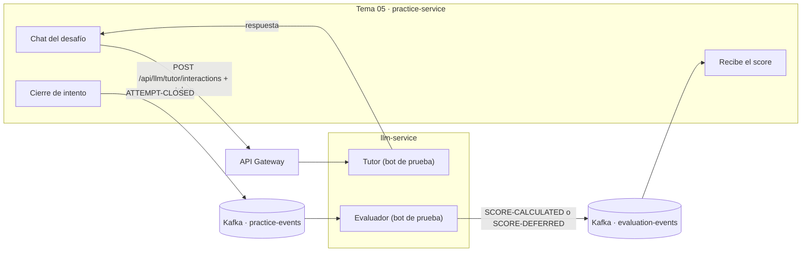

# llm-service — contrato para Desafíos Prácticos (Tema 05) · guía y contrato v1

> **Para quién:** el equipo de Tema 05 (`practice-service`). **Es el único archivo que necesitan:** se
> entiende solo y trae, como anexos, los contratos ejecutables (Anexo A: OpenAPI del tutor; Anexo B:
> AsyncAPI de los eventos Kafka), recortados a lo que les toca. **Cómo leerlo:** la sección 1 explica de
> qué se trata, la 2 es el paso a paso para empezar a probar, de la 5 a la 11 está el contrato
> completo, la 12 cuenta en qué estado está todo y qué sigue, y al final están los anexos.

## 1. En una página

### Qué hace llm-service por ustedes

Le ofrece a Tema 05 dos cosas:

1. **Tutor.** Un alumno escribe en el chat de un desafío, ustedes nos mandan el mensaje por HTTP y
   devolvemos la respuesta del tutor (una guía socrática, sin entregar la solución).
2. **Evaluador.** Cuando un intento se cierra, ustedes publican un evento en Kafka con la conversación
   completa y nosotros devolvemos, también por Kafka, un puntaje de 0 a 100 con su desglose.

### El plan: primero con un bot de prueba, después con el modelo real

| Fase | Qué responde | Para qué sirve |
|---|---|---|
| **1 · Hoy** | Un **bot de prueba** (`fake`), sin modelo de IA real: respuestas de plantilla y puntajes arbitrarios pero con la forma correcta | Que ustedes integren y prueben ya la conexión, los errores y los eventos, sin esperar al proveedor real |
| **2 · Después** | El **modelo real** | La calidad de las respuestas y de los puntajes |

**El contrato es el mismo en las dos fases.** El bot y el modelo real usan el mismo endpoint, el mismo
circuito de eventos y los mismos guardarraíles; pasar de uno al otro lo hacemos nosotros asignando el
modelo (`PUT /api/llm/model-assignments/{function}`), sin redeploy y sin que ustedes cambien código.
Lo único que cambia es el **contenido** de lo que devolvemos, nunca su forma (ver sección 4).

### Cómo se conectan



- **El tutor es síncrono y va por el API Gateway**, con un token de servicio. En la plataforma nunca se le pega directo al servicio (solo en pruebas locales, sección 11).
- **El evaluador es asíncrono y va por Kafka.** Nadie espera la respuesta en pantalla.
- Nosotros nunca otorgamos XP y nunca hablamos con Tema 03: el score llega a ustedes y ustedes se lo
  reenvían a Tema 03.

### Qué se puede probar hoy

| | Estado | Qué hace falta |
|---|---|---|
| **Tutor (HTTP)** | Listo, con el bot | El alta en la plataforma y el token (sección 2) |
| **Evaluador (Kafka)** | Listo de nuestro lado, con el bot | Que exista un broker Kafka compartido y acordar los nombres de topic |

## 2. Cómo arrancar, paso a paso

**Paso 1 · Alta en la plataforma** (lo gestiona el equipo de la plataforma, no nosotros).
`practice-service` tiene que estar dado de alta como cliente en `users-service` con el scope
`llm.tutor.interact`; `llm-service` tiene que estar en la `GATEWAY_ALLOWLIST` del Gateway; y ustedes
registrados en Eureka.

**Paso 2 · Pedir un token de servicio.** Es el patrón de la plataforma para llamadas entre
microservicios (el mismo que usa `echo-service`): un token `client_credentials`, y la llamada
**siempre por el Gateway**. El `audience` es obligatorio y debe ser `llm-service`; si no coincide, el
Gateway responde `403`.

```text
POST {gateway}/api/users/public/auth/token
Content-Type: application/json
```

```json
{
  "clientId": "practice-service",
  "clientSecret": "<de una variable de entorno, nunca del repo>",
  "grantType": "client_credentials",
  "scope": "llm.tutor.interact",
  "audience": "llm-service"
}
```

La respuesta trae `accessToken`. Reutilícenlo mientras sea válido en vez de pedir uno por llamada.

> La ruta y los nombres de los campos del pedido del token son los del patrón que nos pasó el equipo de
> la plataforma; confírmenlos con el equipo de `users-service` antes de usarlos, porque es el servicio
> que emite el token y no lo controlamos nosotros.

**Paso 3 · Llamar al tutor con ese token**, contra el Gateway:

```text
POST {gateway}/api/llm/tutor/interactions
Authorization: Bearer <accessToken>
Idempotency-Key: <uuid nuevo por cada mensaje>
Content-Type: application/json
```

Ejemplo orientativo en Java, sin compilar (Spring `RestClient`, con la base URL apuntando siempre al Gateway):

```java
RestClient http = RestClient.builder().baseUrl(gatewayUrl).build();

Map<String, String> tokenRequest = Map.of(
    "clientId", "practice-service",
    "clientSecret", secret,               // de una variable de entorno
    "grantType", "client_credentials",
    "scope", "llm.tutor.interact",
    "audience", "llm-service");
Map<?, ?> tokenResponse = http.post().uri("/api/users/public/auth/token")
    .contentType(MediaType.APPLICATION_JSON).body(tokenRequest)
    .retrieve().body(Map.class);
String token = (String) tokenResponse.get("accessToken");

Map<?, ?> tutor = http.post().uri("/api/llm/tutor/interactions")
    .header("Authorization", "Bearer " + token)
    .header("Idempotency-Key", UUID.randomUUID().toString())
    .contentType(MediaType.APPLICATION_JSON).body(request)   // el cuerpo de la sección 5
    .retrieve().body(Map.class);
```

Configuración de su lado:

```yaml
practice-service:
  gateway-url: ${GATEWAY_URL:http://api-gateway:8080}
  client-id: ${PRACTICE_CLIENT_ID:practice-service}
  client-secret: ${PRACTICE_CLIENT_SECRET:}
```

> **Identidad delegada, a confirmar.** Nuestro tutor exige el header `X-Delegated-User` y responde
> `403` ("Identidad delegada ausente") si no llega. La receta de la plataforma describe un token de
> servicio sin usuario, y todavía no confirmamos con el equipo del Gateway si en ese caso agrega el
> header. Si les llega ese `403` con un token correcto, es esto y no un error de ustedes. Lo estamos
> resolviendo; si el Gateway no lo agrega, cambiamos el tutor para no exigirlo, sin tocar el contrato.

**Paso 4 · Probar los casos.** Con el bot, esto es lo que tienen que ver (detalle en las secciones 3 y 5):
una respuesta `200` normal, la misma respuesta al repetir la `Idempotency-Key`, y los errores `401`,
`403` y `422`.

**Paso 5 · Evaluador (cuando haya broker).** Publiquen un `ATTEMPT-CLOSED` en `practice-events` y lean
`evaluation-events` (sección 6).

**Paso 6 · Confirmarnos los puntos de la sección 10.** Ninguno cambia el contrato, pero algunos hay que
cerrarlos antes de integrar en serio (broker, nombres de topic y solución esperada).

## 3. Qué va a hacer el bot de prueba

El texto del tutor es **de plantilla y no tiene relación con lo que escribe el alumno**: cita palabras
del prompt que armamos por dentro, así que puede leerse raro. Lo que se valida en esta fase es la
**forma** de la conversación, no su contenido. Una respuesta real del bot:

```json
{
  "message": "¿Qué estructura o patrón te ayudaría a resolver \"TEMA DE LA CONVERSACIÓN: Desafío b1e2c3d4-0002-4a00-8000-000000000002 HISTÓRICO DE CHAT: PREGUNTA ACTUAL DEL\" sin escribir todavía el código completo? Contame qué probaste hasta ahora.",
  "state": "completed",
  "conversacionId": "ee5345bc-c945-4425-a33d-81496d4d785b"
}
```

| Caso | Qué van a ver |
|---|---|
| Mensaje normal | `200`, `state: completed`, pregunta de plantilla, `conversacionId` nuevo (o el que mandaron) |
| Repetir la `Idempotency-Key` con el mismo cuerpo | `200`, exactamente la misma respuesta, sin volver a invocar al bot |
| Mensaje de jailbreak ("ignorá tus instrucciones…") | `200`, `state: completed`, un mensaje fijo de redirección; el bot ni se entera |
| Sin el scope correcto, o desde otro servicio | `401` |
| Sin identidad delegada | `403` |
| Campo obligatorio ausente o `riskLevel` inválido | `422` |
| `state: unavailable` | El bot **no** lo produce. Para probar su pantalla de "tutor no disponible", pídannos que forcemos el fallo |
| Guardarraíl de salida | No se dispara con el bot (su texto nunca trae código) |

**Evaluador con el bot:** devuelve puntajes arbitrarios entre 55 y 95 derivados del texto de la
conversación, con `evaluator: { provider: "fake", model: "fake-evaluator-v1" }`. Sirve para probar el
circuito, no la nota.

## 4. Qué cambia al pasar al modelo real

| Cambia con el modelo real | No cambia |
|---|---|
| El texto del tutor (hoy una pregunta de plantilla, sin relación real con el mensaje) | Rutas, verbos, headers, scope |
| Los puntajes (hoy arbitrarios) | Campos y tipos de request, response y eventos |
| `evaluator.provider` / `evaluator.model` (hoy `fake` / `fake-evaluator-v1`); trátenlos como texto opaco | Códigos HTTP y forma del error |
| La latencia y la frecuencia real de `state: unavailable` y de `SCORE-DEFERRED` | Topics (una vez acordados), `eventType`, Message Key, `eventVersion` |

## 5. Tutor (HTTP) — contrato

`POST /api/llm/tutor/interactions` — siempre por el API Gateway.

**Identidad.** Servicio `practice-service`, scope de servicio **`llm.tutor.interact`**, con usuario delegado.
El Gateway agrega `X-Principal-Type: service`, `X-Service-Id`, `X-Service-Scopes` y `X-Delegated-User`
a partir del token, y propaga `traceparent` y `X-Request-Id`. Ustedes no los mandan; solo hacen falta
si le pegan directo al servicio en una prueba local (sección 11).

**Headers de ustedes:** `Authorization: Bearer <token>`, `Idempotency-Key` (UUID, obligatorio) y `Content-Type: application/json`.

### Request

| Campo | Tipo | | Notas |
|---|---|---|---|
| `attemptId` | UUID | obligatorio | |
| `challengeId` | UUID | obligatorio | |
| `courseCohortId` | UUID | obligatorio | |
| `learnerId` | UUID | obligatorio | |
| `message` | string | obligatorio | No puede estar en blanco. Sin límite de largo validado hoy |
| `riskLevel` | `low` \| `medium` \| `high` | obligatorio | Lo fijan ustedes según el tipo de desafío. Con `low` no corre el guardarraíl de salida |
| `conversacionId` | UUID | opcional | Agrupa turnos. Si no viene se abre una conversación y se devuelve su id |
| `expectedSolution` | string | opcional | Solución esperada del desafío. **Solo la usa el guardarraíl de salida, en memoria**: no se guarda, loguea, audita ni devuelve |

Los campos desconocidos se ignoran.

```json
{
  "attemptId": "b1e2c3d4-0001-4a00-8000-000000000001",
  "challengeId": "b1e2c3d4-0002-4a00-8000-000000000002",
  "courseCohortId": "b1e2c3d4-0003-4a00-8000-000000000003",
  "learnerId": "b1e2c3d4-0004-4a00-8000-000000000004",
  "message": "No entiendo por qué mi recursión no corta en el caso base",
  "riskLevel": "medium",
  "conversacionId": "b1e2c3d4-0005-4a00-8000-000000000005",
  "expectedSolution": "return n <= 1 ? 1 : n * factorial(n - 1);"
}
```

### Response `200`

| Campo | Tipo | Notas |
|---|---|---|
| `message` | string | Siempre presente. En `completed`, el mensaje del tutor; en `unavailable`, un aviso fijo que pueden mostrar o reemplazar |
| `state` | `completed` \| `blocked` \| `unavailable` | `blocked` está **reservado** para cuando exista streaming: hoy no se produce, pero manéjenlo para no tener que tocar nada después |
| `conversacionId` | UUID | Siempre presente |

```json
{
  "message": "¿Qué pasa con `n` en cada llamada recursiva? Fijate qué valor tiene justo antes de que se cumpla la condición de corte.",
  "state": "completed",
  "conversacionId": "b1e2c3d4-0005-4a00-8000-000000000005"
}
```

### Errores

Cuerpo `application/problem+json` (RFC 7807), con `requestId`:

```json
{ "type": "about:blank", "title": "Unprocessable Entity", "status": 422,
  "detail": "riskLevel debe ser high, medium o low",
  "instance": "/api/llm/tutor/interactions", "requestId": "8ea1c242-ca19-43a3-b7c2-177725fff653" }
```

| Código | Cuándo |
|---|---|
| `401` | Servicio distinto de `practice-service` o falta el scope `llm.tutor.interact` |
| `403` | Falta la identidad delegada o no es un UUID |
| `409` | Repitieron una `Idempotency-Key` cuya primera solicitud todavía sigue en curso |
| `422` | Campo obligatorio ausente, `message` en blanco, `riskLevel` fuera del enum, o una `Idempotency-Key` ya usada con otro cuerpo |

**Que el modelo no pueda responder no es un error HTTP:** sea por demora, respuesta inválida, proveedor
caído o presupuesto agotado, el resultado es siempre `200` con `state: unavailable`. No hay cuota por
alumno hoy. Cualquier otro `4xx`/`5xx` que aparezca (por ejemplo `429` si se agrega una cuota) trátenlo
como fallo.

### Comportamiento que pueden usar

- **Idempotencia.** Mismo `Idempotency-Key` y mismo cuerpo → misma respuesta, sin volver a invocar al
  modelo; es seguro reintentar ante un corte de red. `expectedSolution` no entra en la comparación.
  **Una respuesta `unavailable` también queda guardada bajo esa clave:** para reintentar el mismo mensaje
  después de un `unavailable`, usen una `Idempotency-Key` nueva.
- **Guardarraíl de entrada.** Un intento de jailbreak devuelve un mensaje fijo con `state: completed`,
  sin llamar al modelo.
- **Guardarraíl de salida** (solo `riskLevel` `medium`/`high`). Si la respuesta trae un bloque de
  código de 7 o más líneas, o contiene literalmente el `expectedSolution` (sin distinguir
  mayúsculas), se reemplaza por una redirección socrática y el `state` sigue en `completed`. Sin
  `expectedSolution` solo actúa la regla del bloque de código.
- **Timeout.** Cada llamada al modelo espera hasta 8 s y se reintenta hasta 3 veces: con un proveedor
  real que no responde, la respuesta puede tardar unos 25 s antes de llegar como `unavailable`. Con el
  bot es inmediata. Recomendamos un timeout de cliente de 30 s.

## 6. Evaluador (Kafka) — contrato

Ustedes publican el cierre del intento y nosotros devolvemos el score. Envelope estándar de la
plataforma (`eventId`, `eventType`, `eventVersion`, `timestamp`, `producer`, `payload`) en el cuerpo
del mensaje.

> **Los nombres de topic son una propuesta nuestra.** `practice-events` y `evaluation-events` no
> figuran todavía en la tabla de dominios del estándar de Kafka de la plataforma
> (`KAFKA_EVENT_STANDARD.md`, §17), que hoy lista `challenge-events` y otros. Hay que acordarlos con
> ustedes y registrarlos ahí. Si ustedes ya publican en otro topic, lo cambiamos en nuestra
> configuración sin tocar los campos.

### Entrada: `ATTEMPT-CLOSED` en `practice-events`

| Campo del `payload` | Tipo | |
|---|---|---|
| `attemptId` | UUID | obligatorio |
| `courseCohortId` | UUID | obligatorio |
| `learnerId` | UUID | obligatorio |
| `transcript` | array | obligatorio; la conversación alumno-tutor completa, sin truncar |

Forma recomendada de cada elemento del `transcript`: `{ "role": "student" | "tutor", "content": "..." }`.
Solo validamos que sea un array; el evaluador real lee el contenido tal cual, así que cuanto más
completo, mejor puntúa. Si algún día validáramos la forma, sería con un `eventVersion` nuevo.

`eventVersion` de partida: `1`. La Message Key la eligen ustedes; no dependemos de ella.

```json
{
  "eventId": "9f0c6c1e-6d0b-4c53-9a3e-0b1f6c8f2a11",
  "eventType": "ATTEMPT-CLOSED",
  "eventVersion": 1,
  "timestamp": "2026-09-19T15:00:00Z",
  "producer": "practice-service",
  "payload": {
    "attemptId": "b1e2c3d4-0001-4a00-8000-000000000001",
    "courseCohortId": "b1e2c3d4-0003-4a00-8000-000000000003",
    "learnerId": "b1e2c3d4-0004-4a00-8000-000000000004",
    "transcript": [
      { "role": "student", "content": "No entiendo por qué mi recursión no corta" },
      { "role": "tutor", "content": "¿Qué pasa con `n` en cada llamada?" }
    ]
  }
}
```

### Salida: `evaluation-events`, Message Key = `courseCohortId`

**`SCORE-CALCULATED`** (`eventVersion` 1):

| Campo | Tipo | Notas |
|---|---|---|
| `attemptId`, `courseCohortId`, `learnerId` | UUID | Los del evento de entrada |
| `rubricVersionId` | UUID | Rúbrica con la que se evaluó |
| `score` | entero 0-100 | Agregado ponderado con los pesos de la rúbrica, calculado por código (no por el modelo) |
| `dimensions` | objeto | `autonomy`, `clarity`, `progression`, `compliance`, `efficiency`: enteros 0-100 |
| `evaluator` | `{provider, model}` | Texto opaco |

```json
{
  "eventId": "3f1a7c52-8b0e-4d19-a6c4-1d2e9b7f5a30",
  "eventType": "SCORE-CALCULATED",
  "eventVersion": 1,
  "timestamp": "2026-09-19T15:00:04.512Z",
  "producer": "llm-service",
  "payload": {
    "attemptId": "b1e2c3d4-0001-4a00-8000-000000000001",
    "courseCohortId": "b1e2c3d4-0003-4a00-8000-000000000003",
    "learnerId": "b1e2c3d4-0004-4a00-8000-000000000004",
    "rubricVersionId": "10000000-0000-0000-0000-000000000002",
    "score": 76,
    "dimensions": { "autonomy": 80, "clarity": 71, "progression": 68, "compliance": 90, "efficiency": 74 },
    "evaluator": { "provider": "fake", "model": "fake-evaluator-v1" }
  }
}
```

**`SCORE-DEFERRED`** (`eventVersion` 1) cuando no se pudo evaluar: `attemptId`, `courseCohortId`,
`learnerId`, `reason` (`MODEL_UNAVAILABLE` \| `INVALID_MODEL_RESPONSE` \| `RUBRIC_UNAVAILABLE`) y
`retryFrom` (instante ISO-8601 sugerido para reintentar).

### Garantías

| Caso | Qué hacemos |
|---|---|
| Mismo `eventId` repetido | Se ignora; no se vuelve a publicar el score |
| Otro `eventType` en `practice-events` | Se registra y se ignora |
| Falta `attemptId`, `courseCohortId` o `learnerId`, no son UUID, o `transcript` no es un array | Va a `practice-events.dlt`; no se evalúa |
| Evaluación fallida | `SCORE-DEFERRED` con el `reason` |
| Reevaluar un intento | Publicar de nuevo `ATTEMPT-CLOSED` con un `eventId` nuevo; llega otro score. Hoy **no reintentamos solos** un diferido |

Consuman los eventos de score de forma idempotente por `eventId`. Nuestros mensajes llevan además
como headers `eventId`, `eventType`, `eventVersion` y, si los hay, `traceparent` y `X-Request-Id`.

### Cómo funciona y cómo conectarse

**Kafka no es una cola donde el mensaje desaparece al leerlo.** Cada topic es un registro que conserva
los mensajes durante un tiempo (la retención la define el broker), y cada **grupo de consumidores** lee a
su ritmo, con su propio avance (*offset*). Dos servicios con grupos distintos reciben, los dos, todos los
mensajes. Nadie le "pregunta" nada a nadie: uno publica en un topic y el otro está suscripto a ese topic.

| Topic | Publica | Lee | Grupo de consumidores | Message Key |
|---|---|---|---|---|
| `practice-events` | Tema 05 | `llm-service` | `llm-service` | La eligen ustedes |
| `evaluation-events` | `llm-service` | Tema 05 | **El que elijan ustedes** (uno propio y estable, p. ej. `practice-service`) | `courseCohortId` |
| `practice-events.dlt` | `llm-service` | Quien monitoree | — | La del mensaje original |

El flujo completo de un intento:

1. Ustedes cierran el intento y **publican** un `ATTEMPT-CLOSED` en `practice-events`.
2. Nosotros lo leemos, lo evaluamos y dejamos el resultado en una tabla propia (patrón *outbox*).
3. Un proceso nuestro revisa esa tabla **cada 2 segundos** y **publica** el score en `evaluation-events`.
4. Ustedes lo **leen** de `evaluation-events`, filtran por `eventType` y lo relacionan con el intento por
   `payload.attemptId`.

No hay una respuesta directa al `ATTEMPT-CLOSED`: el resultado se espera en `evaluation-events`. Con el
bot llega en unos segundos; con el modelo real, según cuánto tarde el modelo.

**Cómo publican ustedes** (a `practice-events`):

- Clave y valor como texto (`StringSerializer`); el valor es el envelope JSON completo.
- `acks=all` recomendado, y un `eventId` (UUID) único por evento: nosotros deduplicamos por él, así que
  si reintentan un envío, reutilicen el mismo `eventId`.
- Un `ATTEMPT-CLOSED` por intento, publicado cuando el intento ya está cerrado y el `transcript` está
  completo. Para no perder el evento si Kafka no está disponible, conviene guardarlo primero en su base y
  publicarlo después (el mismo patrón *outbox* que usamos nosotros).

```java
// Ejemplo (Spring Kafka, no compilado): publicar el cierre de un intento.
kafkaTemplate.send("practice-events", attemptId.toString(), objectMapper.writeValueAsString(envelope));
```

**Cómo se suscriben ustedes** (a `evaluation-events`):

- Con un **`group.id` propio y estable**. Si usaran el nuestro (`llm-service`), nos repartiríamos los
  mensajes y a ninguno le llegaría todo.
- Clave y valor como texto (`StringDeserializer`) y parsear el JSON: el envelope viene en el cuerpo.
- El topic trae los dos tipos de evento, así que **filtren por `eventType`** (`SCORE-CALCULATED` y
  `SCORE-DEFERRED`). Además viaja como header, para filtrar sin deserializar.
- Recomendamos `auto.offset.reset=earliest` la primera vez, para no perder scores publicados antes de que
  arranquen, y confirmar el offset **después** de procesar cada evento.
- Puede llegar el mismo evento más de una vez: deduplicar por `eventId`.
- El orden solo está garantizado **dentro de una misma cohorte** (misma key, misma partición); no hay
  orden entre cohortes.
- Si un intento se reevalúa pueden llegar varios eventos con el mismo `attemptId` (por ejemplo un
  `SCORE-DEFERRED` y luego un `SCORE-CALCULATED`): quédense con el más reciente por `timestamp`.

```java
// Ejemplo (Spring Kafka, no compilado): recibir los scores.
@KafkaListener(topics = "evaluation-events", groupId = "practice-service")
public void onScore(String body) throws JsonProcessingException {
    JsonNode event = objectMapper.readTree(body);
    String type = event.get("eventType").asText();       // SCORE-CALCULATED | SCORE-DEFERRED
    JsonNode payload = event.get("payload");             // attemptId, score, dimensions...
}
```

**Conexión.** La dirección del broker (`bootstrap.servers`) y, si el broker lo exige, TLS o usuario y
contraseña, los define el equipo que lo administra: hoy no hay un broker compartido definido (ver la
sección 10). Los topics los crea ese equipo; nosotros no los creamos.

## 7. Decisiones tomadas

Cada decisión se puede cambiar sin tocar el contrato salvo donde se indica.

| # | Decisión | Por qué |
|---|---|---|
| D1 | Que el modelo no pueda responder (demora, respuesta inválida, proveedor caído, presupuesto agotado) es `200` + `state: unavailable`, no un `5xx` | El alumno tiene que ver algo en la pantalla del desafío; el error HTTP queda para fallas de integración |
| D2 | La solución esperada la mandan ustedes en `expectedSolution`, opcional | Ustedes controlan cuándo y cuánto exponen; no necesitamos un cliente ni credenciales hacia ustedes |
| D3 | El guardarraíl de salida compara por coincidencia literal y por bloques largos de código | Es lo implementado y probado. Una comparación por similitud (umbral del 70%) mejora la detección sin cambiar el contrato |
| D4 | `blocked` queda reservado en el enum, hoy sin uso | Evita cambiar el contrato cuando se agregue el streaming |
| D5 | El score sale por Kafka a ustedes; nunca hablamos directo con Tema 03 | Un único camino de vuelta; ustedes se lo reenvían a Tema 03 |
| D6 | Message Key de `evaluation-events`: `courseCohortId` | Ordena los scores de una cohorte |
| D7 | Rúbrica única (la plantilla institucional) para todas las cohortes hasta que exista un mapa cohorte → curso | Es interno; lo único visible es `rubricVersionId` en el evento, que ya viaja |
| D8 | Campos, tipos, `eventType` y `eventVersion: 1` de los eventos como figuran en el Anexo B | Un cambio incompatible sería `eventVersion: 2`, con aviso previo |
| D9 | Los nombres de topic (`practice-events`, `evaluation-events`) son una propuesta a acordar | Cambiarlos es configuración nuestra y de ustedes; no altera los campos de los eventos |

## 8. Cómo va a evolucionar (sin romper)

- **Solo cambios aditivos** dentro de una versión: campos opcionales nuevos, valores nuevos en el
  contenido de un campo abierto, códigos de error nuevos. Ignoren los campos que no conozcan.
- **Un cambio incompatible** sale como `eventVersion` nuevo (eventos) o como endpoint nuevo (HTTP),
  con aviso previo, y la versión anterior sigue funcionando en paralelo.
- **Streaming (SSE)** irá en un endpoint aparte, `/tutor/interactions/stream`. El actual no cambia.
- **Evento de ediciones y tests del IDE** (alimenta la dimensión autonomía): será un `eventType`
  nuevo. No modifica `ATTEMPT-CLOSED` ni `SCORE-CALCULATED`.

## 9. Qué no valida el modo test

- La calidad del tutor y de los puntajes, la latencia real y la frecuencia real de `unavailable`.
- La calificación por curso: hoy usamos siempre la rúbrica institucional.
- Que el evaluador tenga contexto del desafío: el evento no lo trae. Un campo opcional
  (por ejemplo `challengeContext`) se puede sumar al `payload` sin cambiar la versión.

## 10. Qué necesitamos que nos confirmen (ninguno cambia el contrato)

1. **Topics.** Que `practice-events` (entrada) y `evaluation-events` (salida) les sirven como nombre, o
   en qué topic publican hoy. Los registramos juntos en el estándar.
2. **Broker.** A qué Kafka y en qué ambiente se conectan; el del compose de `llm-service` es solo
   local. Nosotros y ustedes tenemos que usar el mismo.
3. **Payload de score.** Que `SCORE-CALCULATED` y `SCORE-DEFERRED` les sirven tal cual están.
4. **Transcript.** Que pueden armar `{role, content}` como se recomienda arriba.
5. **Message Key** de `practice-events`, si tienen una preferencia de orden.
6. **Solución esperada.** Que aceptan mandarla en `expectedSolution` (o avisan si prefieren otro camino;
   sería un cambio de contrato y hay que decidirlo antes de integrar).
7. **Evento del IDE.** Quién lo genera, ustedes o Tema 06.
8. **Pantalla de tutor no disponible.** Qué muestran cuando llega `state: unavailable`.

## 11. Cómo probar la conexión

**Contra un ambiente donde `llm-service` esté desplegado:** por el Gateway, con el token del paso 2.

**En local, con el compose de `llm-service`** (necesitan el repo de `llm-service`; requiere
`LLM_CREDENTIALS_MASTER_KEY`, una clave base64 de 32 bytes, y que exista la red `tpi-platform`;
para pruebas locales sirve cualquiera, por ejemplo la que genera `openssl rand -base64 32`):

- **Tutor.** El overlay `compose.debug.yaml` publica el puerto 8086. Como no pasan por el Gateway,
  hay que mandar a mano los headers de identidad que en la plataforma pone él:

  ```bash
  curl -s -X POST http://localhost:8086/api/llm/tutor/interactions \
    -H 'Content-Type: application/json' \
    -H 'Idempotency-Key: 11111111-2222-3333-4444-555555555555' \
    -H 'X-Principal-Type: service' \
    -H 'X-Service-Id: practice-service' \
    -H 'X-Service-Scopes: llm.tutor.interact' \
    -H 'X-Delegated-User: 11111111-1111-1111-1111-111111111111' \
    -d '{"attemptId":"b1e2c3d4-0001-4a00-8000-000000000001","challengeId":"b1e2c3d4-0002-4a00-8000-000000000002","courseCohortId":"b1e2c3d4-0003-4a00-8000-000000000003","learnerId":"b1e2c3d4-0004-4a00-8000-000000000004","message":"No entiendo por qué mi recursión no corta","riskLevel":"medium"}'
  ```

  El perfil `workbench` (`compose.workbench.yaml`) saltea la autenticación por completo.
- **Evaluador.** Con el Kafka del mismo compose (`kafka:9092` dentro de su red): publicar el
  `ATTEMPT-CLOSED` de la sección 6 en `practice-events` (con `kafka-console-producer.sh` dentro del
  contenedor de Kafka) y leer `evaluation-events`.

## 12. Estado de las pruebas y próximos pasos

**Lo que ya probamos de nuestro lado:**

| Qué | Resultado |
|---|---|
| Tutor con el bot, por HTTP | Respuesta normal, repetición de la `Idempotency-Key` con la misma respuesta, y los errores `401`, `403` y `422`. También forzamos un fallo del modelo y responde `200` con `state: unavailable` |
| Evaluador con el bot, con un broker Kafka local | Un `ATTEMPT-CLOSED` válido produce un `SCORE-CALCULATED` con la cohorte como key; un `eventId` repetido no duplica el score; un evento inválido va a `practice-events.dlt`; un fallo del evaluador produce un `SCORE-DEFERRED` |
| Modelo real, en una prueba puntual con un proveedor de prueba | El tutor respondió en español de forma socrática (en menos de 3 s en las dos llamadas que hicimos) y no entregó código ante un pedido directo de la solución. El evaluador devolvió puntajes válidos y distinguió un intento bueno (90) de uno malo (25), pero **puso el mismo valor en las cinco dimensiones**: el desglose por dimensión todavía no es confiable |

**Lo que todavía no está verificado:**

- El **ruteo por el API Gateway**: desde nuestro entorno de pruebas la plataforma hoy no es alcanzable, así que
  no probamos el circuito completo con el token, ni si el Gateway agrega la identidad delegada.
- Un **broker Kafka compartido**: no hay uno definido, así que el circuito de eventos se probó solo con uno local.
- La calidad del evaluador con el modelo real, que falta calibrar.

**Próximos pasos, por equipo:**

| Quién | Qué |
|---|---|
| Equipo de la plataforma | Dar de alta a `practice-service` como cliente con el scope `llm.tutor.interact`; agregar `llm-service` a la allowlist del Gateway; confirmar la ruta del pedido del token y si el Gateway agrega `X-Delegated-User` con un token de servicio; asegurar que `llm-service` y el Gateway se vean en la red |
| Quien administre Kafka | Definir el broker compartido, la seguridad si la hay, y crear los topics (incluida la cola `practice-events.dlt`) |
| Tema 05 | Confirmar los puntos de la sección 10 y empezar a integrar el tutor con el bot |
| `llm-service` | Calibrar el evaluador con el modelo real; resolver el reintento automático de los diferidos y el mapa cohorte → curso para la rúbrica; cambiar el tutor para no exigir la identidad delegada si el Gateway no la agrega |

## Anexo A · OpenAPI del tutor

Contrato ejecutable de `POST /api/llm/tutor/interactions`, para validar un cliente o generar uno. Es un
extracto del contrato completo de `llm-service` recortado al tutor; cuando difiera de las secciones 2 y 5,
avísennos. El número de versión que figura adentro (`2.0.0-proposed`) es el del archivo completo de
`llm-service`: para ustedes rige la versión v1 de esta guía.

```yaml
openapi: 3.1.0
info:
  title: llm-service — tutor (extracto para Tema 05)
  version: 2.0.0-proposed
servers:
- url: "/api/llm"
paths:
  "/tutor/interactions":
    post:
      tags:
      - Practice
      summary: Solicita una respuesta pedagógica segura del tutor
      description: |
        Solo practice-service invoca esta operación. El Gateway debe propagar identidad delegada,
        traceparent y X-Request-Id. expectedSolution es opcional y M2M: solo se usa en memoria para
        el guardarraíl anti-fuga; no se persiste, no se audita y nunca se devuelve.
        Un fallo del modelo NO es un error HTTP: responde 200 con state `unavailable`.
        Mismo Idempotency-Key + mismo cuerpo devuelve la misma respuesta sin volver a invocar al modelo.
      operationId: createTutorInteraction
      security:
      - serviceJwt:
        - llm.tutor.interact
      parameters:
      - "$ref": "#/components/parameters/IdempotencyKey"
      - "$ref": "#/components/parameters/Traceparent"
      - "$ref": "#/components/parameters/RequestId"
      requestBody:
        required: true
        content:
          application/json:
            schema:
              "$ref": "#/components/schemas/TutorInteractionRequest"
      responses:
        '200':
          description: Interacción procesada; state informa si la respuesta se entregó
            o el tutor no está disponible.
          headers:
            X-Request-Id:
              "$ref": "#/components/headers/RequestId"
          content:
            application/json:
              schema:
                "$ref": "#/components/schemas/TutorInteractionResponse"
        '401':
          description: Servicio o scope incorrecto (se exige practice-service con
            llm.tutor.interact).
          content:
            application/problem+json:
              schema:
                "$ref": "#/components/schemas/Problem"
        '403':
          description: Falta la identidad delegada o no es un UUID válido.
          content:
            application/problem+json:
              schema:
                "$ref": "#/components/schemas/Problem"
        '409':
          description: Se repitió una Idempotency-Key cuya primera solicitud todavía
            sigue en curso.
          content:
            application/problem+json:
              schema:
                "$ref": "#/components/schemas/Problem"
        '422':
          description: Cuerpo inválido (campo obligatorio ausente, message en blanco
            o riskLevel fuera del enum), o Idempotency-Key ya usada con otro cuerpo.
          content:
            application/problem+json:
              schema:
                "$ref": "#/components/schemas/Problem"
components:
  parameters:
    IdempotencyKey:
      name: Idempotency-Key
      in: header
      required: true
      schema:
        type: string
        format: uuid
    Traceparent:
      name: traceparent
      in: header
      required: true
      schema:
        type: string
    RequestId:
      name: X-Request-Id
      in: header
      required: true
      schema:
        type: string
        maxLength: 128
  schemas:
    TutorInteractionRequest:
      type: object
      description: Los campos desconocidos se ignoran (lector tolerante), así que
        se pueden agregar campos sin romper.
      required:
      - attemptId
      - challengeId
      - courseCohortId
      - learnerId
      - message
      - riskLevel
      properties:
        attemptId:
          type: string
          format: uuid
        challengeId:
          type: string
          format: uuid
        courseCohortId:
          type: string
          format: uuid
          description: Debe coincidir con el contexto autorizado por Practice.
        learnerId:
          type: string
          format: uuid
        message:
          type: string
          minLength: 1
        riskLevel:
          type: string
          enum:
          - low
          - medium
          - high
          description: Lo fija Tema 05 según el tipo de desafío. Con `low` no corre
            el guardarraíl de salida.
        conversacionId:
          type: string
          format: uuid
          description: Opcional. Agrupa turnos de una misma conversación; si no viene
            se abre una nueva y se devuelve su id.
        expectedSolution:
          type: string
          writeOnly: true
          description: 'Opcional. Material sensible M2M: solo lo usa el guardarraíl
            de salida (con riskLevel medium o high), en memoria; no se persiste, loguea,
            audita ni devuelve. Si el mensaje del tutor la contiene, se reemplaza
            por una redirección socrática.'
    TutorInteractionResponse:
      type: object
      description: Se pueden agregar campos opcionales sin romper a quien ya consume
        (lector tolerante).
      required:
      - message
      - state
      - conversacionId
      properties:
        message:
          type: string
          description: Siempre presente. En `completed`, el mensaje del tutor (nunca
            la solución); en `unavailable`, un aviso fijo.
        state:
          type: string
          enum:
          - completed
          - blocked
          - unavailable
          description: "`blocked` está reservado para la variante con streaming y
            hoy no se produce (cuando el guardarraíl actúa se sustituye el mensaje
            y queda `completed`), pero el consumidor debe manejarlo para no romperse
            cuando se use."
        conversacionId:
          type: string
          format: uuid
    Problem:
      type: object
      description: RFC 7807. `codigo` (código estable de error) está reservado y hoy
        no se emite; no depender de él.
      required:
      - type
      - title
      - status
      - detail
      - requestId
      properties:
        type:
          type: string
          format: uri-reference
        title:
          type: string
        status:
          type: integer
        detail:
          type: string
        instance:
          type: string
          format: uri-reference
        codigo:
          type: string
        requestId:
          type: string
  headers:
    RequestId:
      description: Correlación recibida, devuelta sin cambios.
      schema:
        type: string
  securitySchemes:
    serviceJwt:
      type: http
      scheme: bearer
      bearerFormat: JWT
```

## Anexo B · AsyncAPI de los eventos Kafka

Contrato ejecutable de los dos topics que les tocan, `practice-events` y `evaluation-events`. Es un extracto
del contrato completo recortado a esos dos canales. Ojo con la perspectiva: las operaciones están
descriptas **desde `llm-service`**, así que `receive` significa que nosotros leemos (ustedes publican) y
`send` que nosotros publicamos (ustedes leen). El `host: kafka:9092` es el del compose local de
`llm-service`; el broker real está por definir (sección 10). Sobre los números de versión, vale lo mismo
que en el Anexo A.

```yaml
asyncapi: 3.0.0
info:
  title: llm-service — eventos Kafka (extracto para Tema 05)
  version: 2.0.0
servers:
  platformKafka:
    host: kafka:9092
    protocol: kafka
channels:
  practice-events:
    address: practice-events
    description: 'Dominio de practice-service (Tema 05). Consumido por llm-service.
      Message Key: definida por el productor (Tema 05) — Pendiente de documentar acá
      hasta que confirmen su estrategia.

'
    messages:
      attemptClosed:
        "$ref": "#/components/messages/AttemptClosed"
  evaluation-events:
    address: evaluation-events
    description: 'Dominio de evaluación automática, publicado por llm-service. Message
      Key: `courseCohortId` (preserva el orden de los scores dentro de una misma cohorte/curso).

'
    messages:
      scoreCalculated:
        "$ref": "#/components/messages/ScoreResult"
      scoreDeferred:
        "$ref": "#/components/messages/DeferredScore"
operations:
  consumeAttemptClosed:
    action: receive
    channel:
      "$ref": "#/channels/practice-events"
  publishScoreCalculated:
    action: send
    channel:
      "$ref": "#/channels/evaluation-events"
  publishScoreDeferred:
    action: send
    channel:
      "$ref": "#/channels/evaluation-events"
components:
  messages:
    AttemptClosed:
      payload:
        "$ref": "#/components/schemas/AttemptClosedEvent"
    ScoreResult:
      payload:
        "$ref": "#/components/schemas/ScoreCalculatedEvent"
    DeferredScore:
      payload:
        "$ref": "#/components/schemas/ScoreDeferredEvent"
  schemas:
    AttemptClosedEvent:
      allOf:
      - "$ref": "#/components/schemas/Envelope"
      - type: object
        properties:
          payload:
            type: object
            required:
            - attemptId
            - courseCohortId
            - learnerId
            - transcript
            properties:
              attemptId:
                type: string
                format: uuid
              courseCohortId:
                type: string
                format: uuid
              learnerId:
                type: string
                format: uuid
              transcript:
                type: array
                items:
                  type: object
    ScoreCalculatedEvent:
      description: 'PROVISORIO — propuesta de llm-service, todavía sin validar con
        Tema 05 (consumidor). Implementado en AttemptEvaluationService; el campo `score`
        lo calcula el código con los pesos fijos de la rúbrica, no el modelo (RF-IA-15).

'
      allOf:
      - "$ref": "#/components/schemas/Envelope"
      - type: object
        properties:
          eventType:
            const: SCORE-CALCULATED
          payload:
            type: object
            required:
            - attemptId
            - courseCohortId
            - learnerId
            - rubricVersionId
            - score
            - dimensions
            - evaluator
            properties:
              attemptId:
                type: string
                format: uuid
              courseCohortId:
                type: string
                format: uuid
              learnerId:
                type: string
                format: uuid
              rubricVersionId:
                type: string
                format: uuid
              score:
                type: integer
                minimum: 0
                maximum: 100
                description: Agregado ponderado, redondeado.
              dimensions:
                type: object
                required:
                - autonomy
                - clarity
                - progression
                - compliance
                - efficiency
                additionalProperties: false
                properties:
                  autonomy:
                    type: integer
                    minimum: 0
                    maximum: 100
                  clarity:
                    type: integer
                    minimum: 0
                    maximum: 100
                  progression:
                    type: integer
                    minimum: 0
                    maximum: 100
                  compliance:
                    type: integer
                    minimum: 0
                    maximum: 100
                  efficiency:
                    type: integer
                    minimum: 0
                    maximum: 100
              evaluator:
                type: object
                required:
                - provider
                - model
                properties:
                  provider:
                    type: string
                    description: "`fake` en modo test."
                  model:
                    type: string
                    description: "`fake-evaluator-v1` en modo test."
    ScoreDeferredEvent:
      description: 'PROVISORIO — propuesta de llm-service, todavía sin validar con
        Tema 05. Se publica cuando el intento no se pudo evaluar ahora; `retryFrom`
        es un instante ISO-8601 sugerido para reintentar.

'
      allOf:
      - "$ref": "#/components/schemas/Envelope"
      - type: object
        properties:
          eventType:
            const: SCORE-DEFERRED
          payload:
            type: object
            required:
            - attemptId
            - courseCohortId
            - learnerId
            - reason
            - retryFrom
            properties:
              attemptId:
                type: string
                format: uuid
              courseCohortId:
                type: string
                format: uuid
              learnerId:
                type: string
                format: uuid
              reason:
                type: string
                enum:
                - MODEL_UNAVAILABLE
                - INVALID_MODEL_RESPONSE
                - RUBRIC_UNAVAILABLE
              retryFrom:
                type: string
                format: date-time
    Envelope:
      type: object
      description: Envelope común de plataforma (KAFKA_EVENT_STANDARD.md §5). No renombrar/eliminar
        estos campos.
      required:
      - eventId
      - eventType
      - eventVersion
      - timestamp
      - producer
      - payload
      properties:
        eventId:
          type: string
          format: uuid
          description: UUID único de esta instancia del evento (§6).
        eventType:
          type: string
          description: Hecho del dominio, MAYÚSCULAS-CON-GUIONES, p.ej. MESSAGE-UNBLOCKED
            (§7).
        eventVersion:
          type: integer
          minimum: 1
          description: Versión del contrato de este eventType, empieza en 1 (§8).
        timestamp:
          type: string
          format: date-time
          description: ISO 8601 UTC (§9).
        producer:
          type: string
          description: Identificador del microservicio productor (§10).
        payload:
          type: object
          description: Datos específicos del eventType/eventVersion (§11).
```
