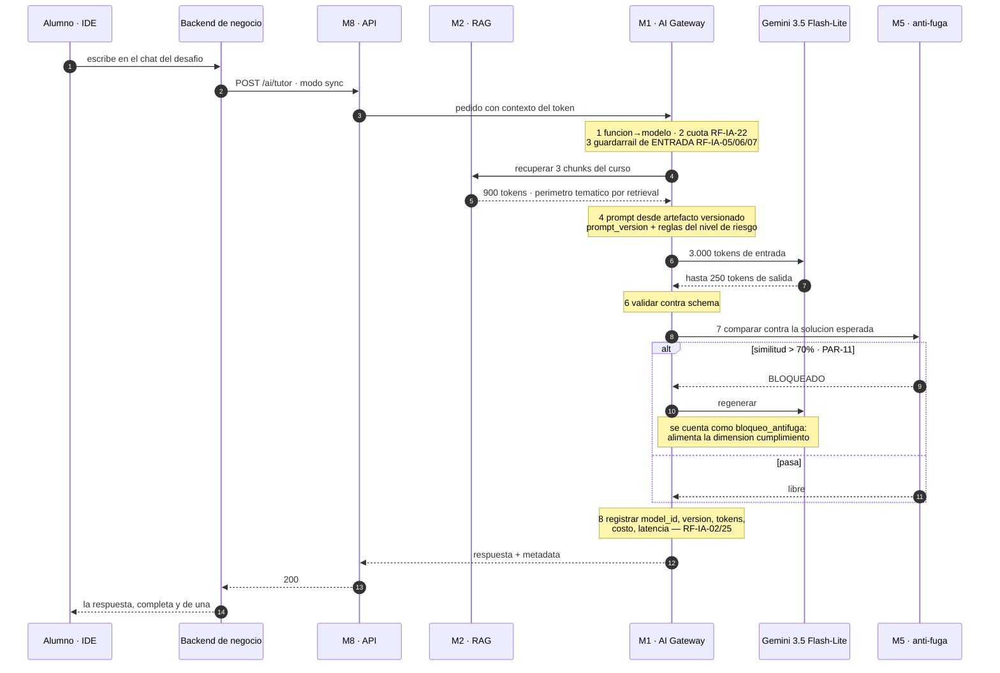
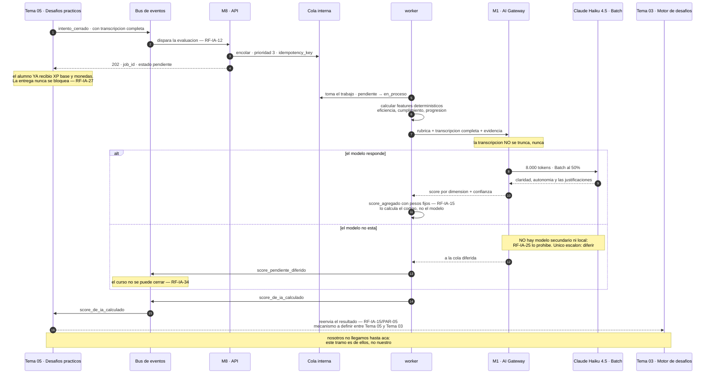

# Tema 05 — Desafíos Prácticos — contratos

> **Fuente ejecutable:** [`../llm-service.openapi.yaml`](../llm-service.openapi.yaml). Este archivo
> explica acuerdos y evolución; los ejemplos `/ai/**` y cualquier referencia a V1 son históricos.

> Este documento es el contrato completo y vigente con Tema 05 (incluye los diagramas de
> secuencia del tutor y el evaluador) — `18` §4 ya no repite este detalle. Carta original:
> [docs/entregas/alcance-y-contrato-para-desafios-practicos.md](../../01-vision-alcance-y-entrega/03-entregas/alcance-y-contrato-para-desafios-practicos.md).
> Reglas generales: [18 §0](../91-contratos-inter-equipos-historicos.md#0-cómo-leemos-los-contratos).

## Qué nos llama

- `POST /ai/tutor` (asistencia sincrónica, presupuesto **< 2 s**) → hoy es
  `POST /api/llm/tutor/interactions` en el contrato v1 vigente
  ([`llm-service-v1.openapi.yaml`](../historicos-y-contratos-v1/llm-service-v1.openapi.yaml)).

### Diagrama de secuencia completo (también vive en [17 §3](../90-mapa-de-integracion-historico.md#3-camino-sincrónico-a--el-tutor))

El más difícil de los cinco: hay alguien mirando la pantalla, y la respuesta **no se puede
mostrar hasta compararla contra la solución esperada** (RF-IA-20). Eso es lo que mata el
streaming token a token y lo que convierte al guardarraíl de salida en parte del presupuesto
de latencia.



**El presupuesto de los 2 segundos, tramo por tramo:**

| Tramo | Cuánto | De dónde sale |
|---|---|---|
| AI Gateway determinístico, los 8 pasos | **+5 a 50 ms** | Medido, [06](../../06-operacion-calidad-y-pruebas/01-operacion-e-ingenieria.md) |
| Retrieval sobre pgvector | se revisa ADR-004 si pasa de **100 ms** | Umbral de ADR-004 |
| Llamada al modelo | Flash-Lite **~280 ms** al primer token; Haiku 4.5 **~597 ms** | [03](../../03-capacidades-de-ia/01-modelos-costos-y-contexto.md) §7 |
| Guardarraíl anti-fuga | 🔴 **sin presupuesto propio** | — |
| Regeneración, si bloquea | 🔴 **otra llamada entera, sin presupuesto** | — |
| **Objetivo declarado** | **< 2 s hasta la respuesta completa** | [02](../../02-arquitectura-y-plataforma/01-arquitectura-y-stack.md) §5 |

> 🔴 **Dos agujeros de este presupuesto, sin resolver:** (1) el único número medido es el
> **primer token**, y sin streaming lo que importa es la respuesta completa — nadie lo midió
> todavía; (2) el cálculo del pico de tráfico usa ~8 s por respuesta contra un objetivo de 2 s
> — de esa brecha depende cuántas réplicas hacen falta (I-03 en `17` §8).

### Cuerpo de la solicitud ✅ (schema real: `TutorInteractionRequest`)

```json
{
  "attemptId": "b1e2c3d4-0001-4a00-8000-000000000001",
  "challengeId": "b1e2c3d4-0002-4a00-8000-000000000002",
  "courseCohortId": "b1e2c3d4-0003-4a00-8000-000000000003",
  "learnerId": "b1e2c3d4-0004-4a00-8000-000000000004",
  "message": "No entiendo por qué mi recursión no corta en el caso base",
  "riskLevel": "medium"
}
```

Header obligatorio: `Idempotency-Key` (UUID). `riskLevel` es el único campo que hoy decide el
comportamiento del guardarraíl (`high | medium | low`) — lo fija Tema 05 según el tipo de
desafío, nosotros no lo inferimos.

## Qué le damos

- Respuesta completa del tutor (200), **síncrona, sin streaming todavía** — ver
  [`pendientes.md`](../../07-planificacion-y-trabajo-equipo/11-equipos/tema-05-desafios-practicos/pendientes.md).
- El guardarraíl anti-fuga (RF-IA-20) corre de nuestro lado antes de devolver la respuesta:
  nunca se expone la solución ni los tests ocultos (ADR-008).

### Cuerpo de la respuesta ✅ (schema real: `TutorInteractionResponse`)

```json
{
  "message": "¿Qué pasa con `n` en cada llamada recursiva? Fijate qué valor tiene justo antes de que se cumpla la condición de corte.",
  "state": "completed"
}
```

`state` es el único enum publicado hoy: `completed | blocked | unavailable`. Es más angosto que
lo que muestran los diagramas de doc 17 (que hablan de streaming y de estados intermedios) —
mientras no se fusione la adenda SSE, esto es todo lo que el contrato ejecutable promete.

## Qué pasa si esto falla

Técnica común (Resilience4j, escalera de degradación) en
[transversales del README](../README.md#resiliencia-y-manejo-de-errores-técnica-común-a-todos-los-endpoints).
Caso puntual del tutor, vía el campo `state` de la respuesta:

| `state` | Cuándo pasa | Qué ve Tema 05 |
|---|---|---|
| `completed` | El modelo respondió y pasó el guardarraíl de salida | Respuesta normal |
| `blocked` | El guardarraíl anti-fuga (ADR-008) detectó que la respuesta se acercaba a la solución esperada | Mensaje regenerado o bloqueado — **hoy no se produce en el código real** (`docs/estado-implementacion/ep-05/interactions.md`): solo hay guardarraíl de entrada implementado, el de salida está pendiente |
| `unavailable` | Se agotó la escalera de degradación (Nivel 1-3 fallaron: modelo primario, otro proveedor, modelo local) | El tutor no puede responder — presupuesto de 2 s ya se gastó en los reintentos, así que no hay margen para más de un fallback |

Si el `503`/`unavailable` se sostiene, Tema 05 tiene que decidir qué mostrarle al alumno — no
hay hoy un acuerdo escrito de UX para ese caso (relacionado con la pantalla 1 de
[`frontend-angular/pendientes.md`](../../07-planificacion-y-trabajo-equipo/11-equipos/frontend-angular/pendientes.md)).

## Cierre de intento y entrega del score (evaluador) — decisión de diseño 2026-09-13

> Antes de esta decisión, el evento de cierre de intento lo publicaba Tema 03 y el score volvía
> directo a Tema 03. **Desde ahora todo el intercambio del evaluador pasa por ustedes** —
> nosotros no volvemos a hablar directo con el Motor de Desafíos. El contrato anterior queda
> retirado y documentado como tal en
> [`tema-03-motor-de-desafios.md`](tema-03-motor-de-desafios.md).

### Diagrama de secuencia completo (también vive en [17 §5](../90-mapa-de-integracion-historico.md#5-camino-asincrónico--el-evaluador))

Nadie está mirando la pantalla, así que va por cola. Eso compra tres cosas de un saque: **−50%
de costo con Batch**, el pico absorbido, y RF-IA-27 implementado por construcción. El evaluador
es el único sin fallback de modelo (RF-IA-25), así que su escalera de degradación tiene dos
escalones en vez de cuatro.



**Cuánto tarda de punta a punta:**

| Tramo | Cuánto |
|---|---|
| Aceptar y encolar | Milisegundos. Es lo que hace que el pico no tumbe nada |
| Una evaluación | «Minutos» — 🔴 **no hay número, y la Batch API suele tardar horas** |
| Pico de cierre: ~240 trabajos, 4 workers | **~20 minutos de drenado** |
| Recalibración | Mensual, PAR-15, **fuera de horario pico** |

### Qué nos dan: el cierre del intento

Ustedes nos notifican el cierre del intento del alumno — con la transcripción completa — en vez
de que lo haga Tema 03. Es el mismo evento que ya estaba definido en
[18 §3](../91-contratos-inter-equipos-historicos.md#3-eventos-que-consumimos); lo único que cambia es
quién lo publica:

```json
{
  "evento":           "intento_cerrado",
  "version":          "1.x",
  "trace_id":         "uuid — OBLIGATORIO",
  "timestamp":        "ISO-8601",
  "curso_cohorte_id": "uuid — OBLIGATORIO",
  "intento_id":       "uuid — OBLIGATORIO",
  "alumno_id":        "uuid — OBLIGATORIO",
  "rubric_version":   "v1.1 — OBLIGATORIO",
  "transcripcion":    []
}
```

Esto además resuelve, a favor de la **Opción A** que ya proponíamos, la pregunta abierta de
quién es dueño de la transcripción alumno-tutor
([`docs/entregas/alcance-y-contrato-para-desafios-practicos.md`](../../01-vision-alcance-y-entrega/03-entregas/alcance-y-contrato-para-desafios-practicos.md)
§5.4, B-2): la guardan ustedes, dueños de la UI del chat, y nos la entregan completa al cerrar el
intento.

### Qué les damos: el resultado del evaluador

Les entregamos el score (`score_de_ia_calculado`, 0-100 con desglose por dimensión) por **evento
Kafka** — no webhook, no polling — porque Kafka es el único bus de integración acordado
([00 §6](../../00-gobierno-y-evolucion/01-fuentes-de-verdad-y-convenciones.md#6-pares-y-comunicación)). Es el mismo
mecanismo y el mismo payload que ya estaba acordado en
[18 §2.1](../91-contratos-inter-equipos-historicos.md#21-score_de_ia_calculado); lo único que cambia es
el consumidor:

El schema y el envelope ejecutables viven **una sola vez** en
[`contracts/llm-service.asyncapi.yaml`](../llm-service.asyncapi.yaml), mensaje
`ScoreCalculated`. Este documento conserva el flujo, el consumidor y las responsabilidades de
Tema 05; no vuelve a copiar el JSON histórico de `18 §2.1`. Ese ejemplo snake_case se mantiene
únicamente en el documento histórico para poder contrastar la decisión de cambio.

Si el evaluador no puede completar, publicamos `score_pendiente_diferido` con `motivo` y
`reintentar_desde` — mismo payload acordado en
[18 §2.2](../91-contratos-inter-equipos-historicos.md#22-score_pendiente_diferido), mismo cambio de
consumidor.

**Ustedes son responsables de reenviarle este resultado a Tema 03** para que aplique el
modificador de XP (PAR-05) — nosotros no le mandamos nada directo al Motor de Desafíos, ni el
score ni el evento de cierre. Cómo hacen ese reenvío (evento propio de ustedes, llamada HTTP, lo
que acuerden con Tema 03) es un problema suyo, no nuestro. Lo que no cambia: **nosotros nunca
otorgamos XP**, eso lo sigue calculando y aplicando el Motor de Desafíos.

**Sin decidir todavía** (ver [`pendientes.md`](../../07-planificacion-y-trabajo-equipo/11-equipos/tema-05-desafios-practicos/pendientes.md)): el tópico/nombre de versión
exacto de estos eventos con el nuevo consumidor.

## Deslinde de alcance ya acordado

- **"Originalidad entre alumnos"** (comparar una entrega contra otra, o contra ediciones
  anteriores del mismo alumno) **es responsabilidad de Tema 05, no nuestra**
  ([`02-arquitectura-y-stack.md`](../../02-arquitectura-y-plataforma/01-arquitectura-y-stack.md) línea 303). Lo nuestro es
  el perímetro anti-fuga de un único intento contra su propia solución esperada.
- La carta completa de alcance ([`docs/entregas/alcance-y-contrato-para-desafios-practicos.md`](../../01-vision-alcance-y-entrega/03-entregas/alcance-y-contrato-para-desafios-practicos.md))
  ya detalla esta frontera para que Tema 05 la lea sin ambigüedad.
