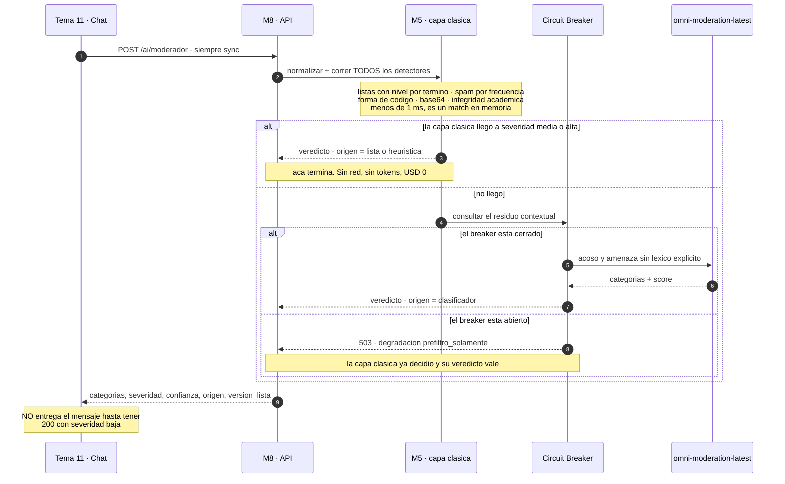

# Tema 11 — Chat — contratos

> **Fuente ejecutable:** [`../llm-service.openapi.yaml`](../llm-service.openapi.yaml). Este archivo
> conserva el diseño de Chat; `/ai/**` sólo describe una propuesta anterior, no una ruta para el
> frontend ni para nuevos consumidores.

> Este documento es el contrato completo y vigente con Tema 11 (incluye el diagrama de
> secuencia del moderador) — `18` §4 ya no repite este detalle. Contexto adicional:
> [04-funciones-de-ia.md](../../03-capacidades-de-ia/02-funciones-de-ia.md) líneas 1658-1679 ("qué construimos y qué
> no"). Reglas generales: [18 §0](../91-contratos-inter-equipos-historicos.md#0-cómo-leemos-los-contratos).

## Qué nos llama

- `POST /ai/moderador` — siempre sincrónico, siempre antes de entregar el mensaje al hilo
  (presupuesto **< 300 ms**). **No está en el contrato v1 vigente** — vive solo en el borrador
  [`llm-service-v1-moderacion-borrador.yaml`](../historicos-y-contratos-v1/llm-service-v1-moderacion-borrador.yaml)
  (EP-08, sin implementar).

### Cuerpo de la solicitud 🟡 (borrador — sin implementar, pero con schema detallado)

```json
{
  "contexto": {
    "curso_cohorte_id": "b1e2c3d4-0003-4a00-8000-000000000003",
    "usuario_ref": "ref-opaca-alumno-001"
  },
  "payload": {
    "mensaje": "che alguien tiene el codigo de la practica 3??",
    "canal_ref": "canal-comision-2b",
    "autor_ref": "ref-opaca-alumno-001",
    "desafio_activo": true
  },
  "modo": "sync",
  "idempotency_key": "idem-mod-0001"
}
```

`desafio_activo` lo tiene que mandar Tema 11 — nosotros no podemos deducir si el emisor tiene un
desafío en curso, y la heurística de integridad académica (bloque de código pegado en el chat)
lo necesita.

### Diagrama de secuencia completo (también vive en [17 §4](../90-mapa-de-integracion-historico.md#4-camino-sincrónico-b--el-moderador))

El presupuesto más ajustado de todo el sistema: **300 ms**, y está en el camino de entrega del
mensaje. Por eso ADR-012 lo resolvió al revés que las otras cuatro funciones: **la mayoría de
los casos no sale del proceso**.



| Etapa | Cuánto tarda | Qué resuelve |
|---|---|---|
| Capa clásica, todos los detectores | **< 1 ms** | 4 de las 6 categorías de RF-CHT-10 |
| Clasificador externo | **200 a 500 ms** | Solo el residuo: acoso y amenaza sin léxico explícito |
| Factor entre las dos | **~1000×** | Por eso ADR-012 empuja todo lo que puede al lado determinístico |
| Timeout hacia el clasificador | **1 s** | Al vencerse: `prefiltro_solamente` |
| **Objetivo total** | **< 300 ms** | Es lo único que importa en esta función |

**El campo `origen` no es telemetría decorativa.** Es lo único que permite medir qué proporción
resuelve la capa clásica —la palanca dice «−70% o más», y eso **era una suposición**— y es lo
primero que se mira para depurar un falso positivo.

> 🔴 **Tres cosas que este diagrama deja a la vista** (detalle completo en `17` §4, I-01/I-02):
> el corte entre las dos capas está escrito de dos formas distintas en dos documentos (I-01); un
> timeout de 1 s no entra en un presupuesto de 300 ms y nadie escribió qué pasa en el medio
> (I-02); y el acoso acumulativo no lo detecta ninguna de las dos capas porque el contrato evalúa
> un mensaje por vez, sin estado por hilo.

## Qué nos da

- Define el contrato de eventos del bus **para toda la plataforma** — su decisión condiciona a
  cinco equipos. Ver [`pendientes.md`](../../07-planificacion-y-trabajo-equipo/11-equipos/tema-11-chat/pendientes.md) sobre por qué esto es urgente por
  secuencia.

## Qué le damos

✅ **Forma única y canónica, fijada el 2026-09-12** (ver
[`pendientes.md`](../../07-planificacion-y-trabajo-equipo/11-equipos/tema-11-chat/pendientes.md) para el porqué): la de
[`llm-service-v1-moderacion-borrador.yaml`](../historicos-y-contratos-v1/llm-service-v1-moderacion-borrador.yaml)
(`RespuestaModeracion`) — reemplaza el bosquejo más viejo que tenía doc 18 §4.4.

```json
{
  "resultado": {
    "categorias": ["integridad_academica"],
    "severidad": "media",
    "confianza": 0.94,
    "origen": "heuristica",
    "version_lista": "2025-05-v3"
  },
  "trace_id": "6d1f7a10-0000-4000-8000-000000000010",
  "metadata": {
    "model_id": null,
    "model_version": null,
    "latencia_ms": 45
  }
}
```

`categorias` es un **array de enum** (`ofensivo_discriminatorio`, `acoso`,
`sexual_violencia`, `spam_no_academico`, `integridad_academica`, `elusion_solo_texto` — las
seis de RF-CHT-10), no un objeto de booleanos, y puede traer más de una a la vez porque los
detectores clásicos corren todos y fusionan veredictos. **No hay campo `veredicto`**: el
bloqueo se infiere de `severidad` (`media`/`alta` bloquean, `baja` no).

**Tema 11 no entrega el mensaje al hilo hasta recibir una respuesta con `severidad: baja`.**

## Qué pasa si esto falla

Técnica común en
[transversales del README](../README.md#resiliencia-y-manejo-de-errores-técnica-común-a-todos-los-endpoints).
El moderador tiene su propio par de errores tipados, ya en el schema del borrador — **no son
propuesta, son schema real** (`ErrorCuota` y `ErrorProveedor`):

**Cuota agotada:**

```json
{ "error": "cuota_agotada", "limite": 15, "reinicia_en": "2026-09-13T00:00:00Z" }
```

**Proveedor (clasificador externo) no disponible — dos variantes de degradación:**

```json
{ "error": "proveedor_no_disponible", "degradacion": "prefiltro_solamente" }
```

```json
{ "error": "proveedor_no_disponible", "degradacion": "diferido" }
```

- **`prefiltro_solamente`** (Circuit Breaker abierto): la capa clásica sigue decidiendo sola —
  es la red que hace tolerable el fail-open. Sin esta capa, fail-open significaría *sin ninguna
  moderación*.
- **`diferido`**: el mensaje se entrega marcado y se re-modera cuando el clasificador vuelve;
  si en la re-moderación resulta `media`/`alta`, se retira y se genera el incidente
  retroactivamente.

**Decisión de producto ya resuelta (P-02, recomendación fail-open con red):** ante cualquier
falla, **el mensaje se entrega** — el chat social no es producción académica, y RF-IA-27
prohíbe bloquear al alumno por una caída externa. Fail-closed (detener el chat) quedó
descartado.

## Deslinde de alcance ya acordado

**"El chat es del Tema 11. Nosotros aportamos una función, no una funcionalidad"** (doc 04).
De ellos: el chat completo (canales, hilos, citas, entrega), la pantalla del dashboard de
incidentes, el envío de notificaciones, la ejecución de la purga al archivar el curso. De
nosotros: la capa clásica + clasificador, el registro de incidentes, el evento de severidad
alta, la marca de retención.
